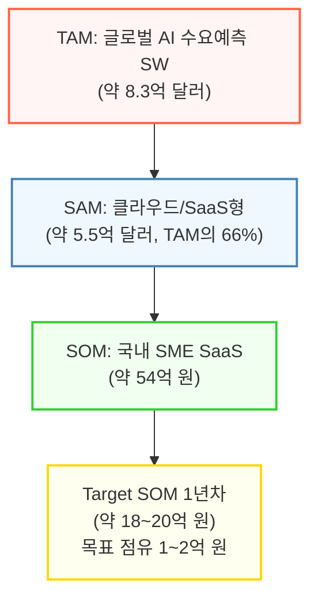
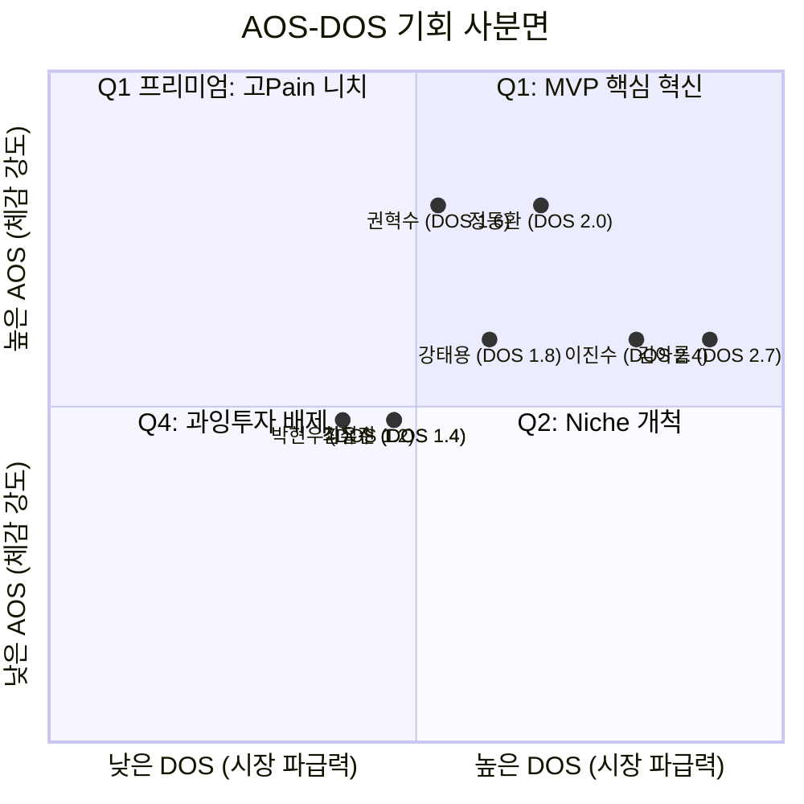
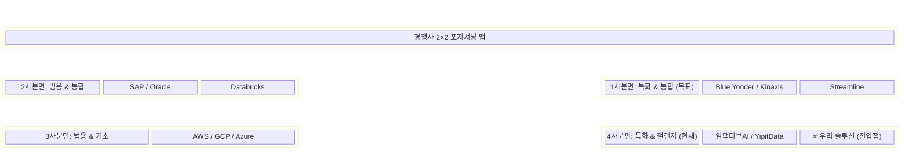
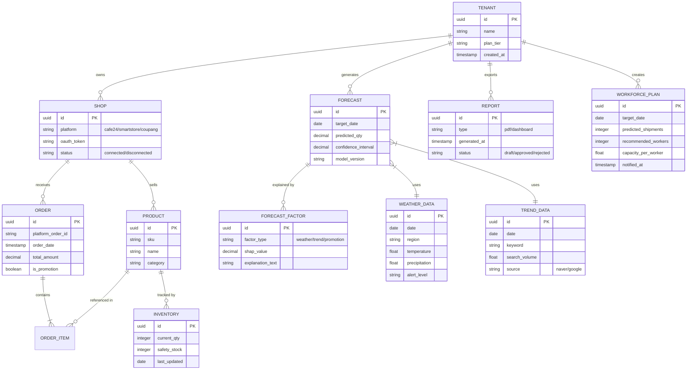
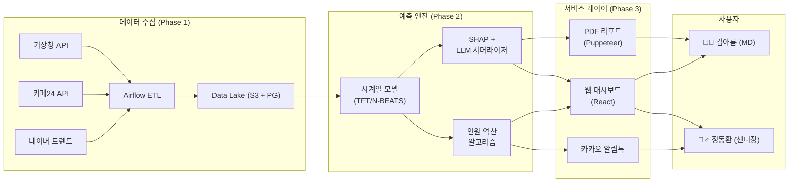
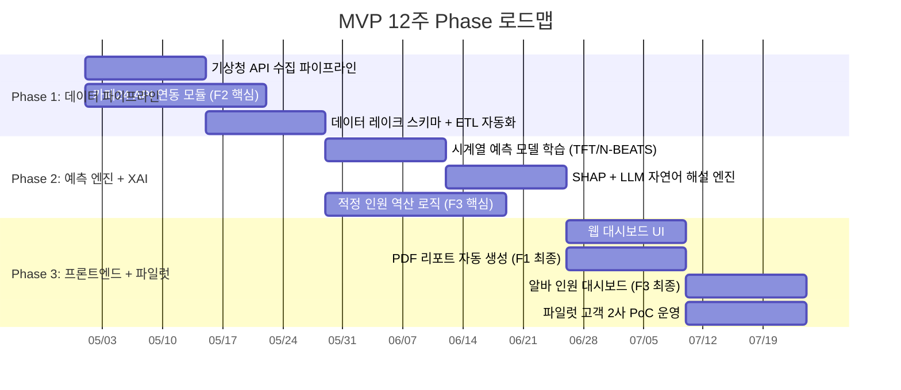

# B2B 수요예측 AI SaaS — PRD v0.1

- **Owner 팀:** Product & AI Engineering
- **최종 업데이트:** 2026-04-15
- **VPS 원본 참조:** `04_VPS-final/06_VPS-Integrated-V2.md`
- **문서 상태:** Draft — 이해관계자 리뷰 대기

---

## 1. 개요·목표

### 1-1. 문제 정의 (Pain 지표 포함)

> **[자체 IT 인프라나 고급 데이터 개발 조직이 없어 수요 관리에 취약하지만, 폭발하는 외부 환경 변동성에 매일 맨몸으로 맞서야 하는 B2B 실무 담당자]**가  
> **[날씨, 유통기한, 트렌드, 돌발 프로모션 등 예측하기 힘든 외부 변수를 즉각 반영하여 당일 발주량 및 창고 알바 인원 스케줄을 결정해야 하는 상황]**에서  
> **[기존 수기 엑셀의 한계와 AI 블랙박스 불투명성으로 인해 대규모 결품·악성 재고 폐기가 발생하여 영업이익이 훼손되는 문제]**를 해결합니다.
>
> — *VPS §1-5 통합 문제 정의 인용*

#### Pain 수치화 — 율(%) + 절대 비용(₩/시간) 이중 표기

| 페르소나 | Pain 항목 | 실패 KPI (율) | 절대 비용 (₩/시간) | VPS 출처 |
|---|---|---|---|---|
| **김아름** (이커머스 MD) | 외부 변수 미반영으로 인한 대규모 품절 | 월 결품률 15% | 월 기회손실 **2,500만 원** | §1-9 Case 1 |
| **김아름** | 기상·트렌드 엑셀 수동 취합 야근 | — | 일일 **4시간** 야근 | §1-9 Case 1 |
| **김아름** | 경영진 발주 품의서 반려 | 월 반려 횟수 **5회** | 재검토 소요 시간 누적 | §2-1 Outcome |
| **권혁수** (콜드체인) | 온도/유통기한 이탈로 전량 폐기 | 휴먼 에러 연 **2회** | 사고당 **3억~10억 원** 폐기 | §1-9 Case 2 |
| **정동환** (3PL 센터장) | 화주 프로모션 미공유로 인건비 적자 | 오버 스케줄링 낭비율 **20%+** | 일일 허공 인건비 **80만 원** | §1-9 Case 3 |
| **정동환** | 인원 부족으로 출고 지연 | 월 화주 클레임 다수 | 위약금 + 신뢰 훼손 | §2-3 Outcome |

---

### 1-2. 시장 규모 (TAM / SAM / SOM)

> *VPS §1-6 직접 인용*

| 구분 | 시장 정의 | 규모 | 근거 |
|---|---|---|---|
| **TAM** | 글로벌 AI 수요예측 소프트웨어 시장 | **약 8억 2,770만 달러** (약 1조 1,100억 원) | FMI 2025년 글로벌 통계 |
| **SAM** | 클라우드/SaaS형 수요예측 AI 시장 | **약 5억 4,630만 달러** (약 7,300억 원) | TAM × 클라우드 비중 66% |
| **SOM** | 글로벌+국내 SME 대상 SaaS 시장 | 글로벌 약 2억 3,490만 달러 / **국내 약 54억 원** | SAM × SME 비중 43% |
| **Target SOM (1년 차)** | 국내 리테일/이커머스 SME SaaS | **약 18~20억 원** | SOM × 이커머스/리테일 35% |

> **1년 차 점유 목표:** Target SOM ~20억 원 중 5~10% = **약 1억~2억 원** (초기 레퍼런스 고객 10~20곳)

---

### 1-3. 목표 (Desired Outcome 수치화)

#### 북극성 KPI

| KPI | 기준선 (As-Is) | 목표값 (To-Be) | 측정 주기 |
|---|---|---|---|
| **고객의 수요예측 기반 의사결정 정확도 향상에 따른 재무 손실 방어율** | 0% (도구 부재) | ≥ **90%** (결품·폐기·인건비 손실 방어) | 월간 |

#### 보조 KPI

| KPI | 기준선 | 목표값 | 측정 주기 |
|---|---|---|---|
| 파일럿 고객 발주 리포트 1-pass 결재율 | 0% (신규) | ≥ **80%** | 주간 |
| 일용직 인건비 절감률 (3PL 고객) | 0% | ≥ **30%** | 월간 |
| 카페24 API 연동 성공률 | 0% | ≥ **95%** | 주간 |
| MVP Phase 파일럿 고객 확보 | 0곳 | **2사 이상** | Sprint 3 종료 시 |
| NPS (파일럿 고객) | — | ≥ **40** | 분기 |

---

### 1-4. 페르소나별 Outcome KPI 매핑 테이블

> *VPS §2 "고객이 원하는 Outcome" 수치를 기준선으로 활용*

| 페르소나 | Outcome 항목 | 기준선 (VPS 인용) | 목표값 | 측정 주기 |
|---|---|---|---|---|
| **김아름** | 결품/과발주 기회손실액 | 월 2,500만 원 | **0원 방어** | 월간 |
| **김아름** | 기상·엑셀 취합 야근 시간 | 일 4시간 | **≤ 10분** | 일간 |
| **김아름** | 경영진 품의서 반려 횟수 | 월 5회 | **0회 (1-pass)** | 월간 |
| **권혁수** | 온도 이탈 통제 실패 | 연 2회 | **0건** | 연간 |
| **권혁수** | 의약품 폐기 손실금 | 사고당 3억~10억 원 | **0원** | 연간 |
| **정동환** | 초과 알바 잉여 임금 | 일 80만 원 | **0원** | 일간 |
| **정동환** | 출고 지연 화주 클레임 | 월 다수 | **월 0건** | 월간 |

---

## 2. 사용자와 페르소나

### 2-1. 핵심 페르소나 요약

> *VPS §1-7 페르소나 스펙트럼 12인 중 MVP 타겟 Top 3 (DOS Q1 상위)*

| 우선순위 | 페르소나 | 직무 | 핵심 Pain | DOS 점수 | 시장 근거 |
|:---:|---|---|---|:---:|---|
| **1** | **김아름** | 이커머스/코스메틱 MD | 외부 변수(날씨/트렌드) 미반영 → 대규모 품절 | **2.7** | Q1 이커머스 SME |
| **2** | **정동환** | 3PL 물류센터장 | 화주 프로모션 누락 → 인건비 덤핑 | **2.0** | Q1 물류 |
| **3** | **권혁수** | 바이오 콜드체인 담당 | 유통기한/온도 이탈 → 수억 원 전량 폐기 | **1.6** | Q1 프리미엄 |

---

### 2-2. 페르소나 분류 체계 (핵심/확장/극단/비활성)

> *VPS §1-7 기반*

| 분류 | 대상 | PRD 반영 수준 |
|---|---|---|
| 🟢 **핵심 (Core)** | 김아름, 박현우, 이진수, 최유진, **정동환** | MVP F1~F3 직접 타겟 |
| 🟡 **확장 (Adjacent)** | **권혁수**, 송미란, 이유리 | Post-MVP F4~F5 대상 |
| 🟠 **극단 (Extreme)** | 김철수, 강태용 | 엣지 케이스 테스트 활용 |
| 🔴 **비활성 (Non-target)** | 알렉스 정, 박영자 | MVP 요구사항 반영 금지 |

> **MVP 직접 타겟:** 김아름 + 정동환 (VPS §4-1)  
> **Post-MVP 프리미엄 타겟:** 권혁수 (VPS §5-1)

---

### 2-3. AOS-DOS 사분면 요약

> *VPS §1-8 직접 인용*

#### AOS-DOS 전략 요약 (VPS §1-8)

| 사분면 | 대상 | 행동 |
|---|---|---|
| 🔥 **Q1** 혁신 | 김아름·이진수·정동환·강태용·권혁수 | 리소스 80% 집중 |
| 💡 **Q2** 개선 | 최유진·김철수·박현우·이유리 | 코어 런칭 후 업셀링 |
| ⚙️ **Q3** 캐시카우 | 알렉스 정 | Headless API 납품 |
| 🚫 **Q4** 배제 | 송미란·박영자 | MVP 반영 금지 |

---

## 3. 사용자 스토리와 수용 기준 (AC)

### Story 1 — 김아름 (이커머스 MD): 결재 방어용 일일 발주 리포트

> **As a** 이커머스 MD (김아름),  
> **I want** 기상·트렌드·매출 변수가 융합된 XAI 발주 권장 리포트를 원클릭으로 생성하여,  
> **So that** 경영진 결재를 1-pass로 통과시키고 품절 기회손실을 방어할 수 있다.

| 필드 | 내용 |
|---|---|
| **Job Statement** | 외부 트렌드를 실시간 반영한 권장 발주량을 도출해, 임원진 결재를 한 번에 통과 *(VPS §1-9 Case 1)* |
| **전환 장벽 (Habit)** | *"그래도 대표님은 엑셀 표 아니면 안 읽으시는데?"* — 구세대 보고 관행 *(VPS §1-9 Case 1)* |
| **사용자 불안 (Anxiety)** | *"새 시스템이 뽑은 숫자가 틀리면, 결국 내 책임(독박) 아닌가?"* *(VPS §1-9 Case 1)* |
| **Switch Trigger** | 대규모 결품 사태 후 시말서를 썼던 날 *(VPS §1-9 Case 1)* |

#### Acceptance Criteria

| AC # | Given | When | Then | 수치 임계치 |
|---|---|---|---|---|
| **AC-1** | 기상청 API·네이버 트렌드·쇼핑몰 매출 데이터가 수집 완료 상태일 때 | 사용자가 '리포트 생성' 버튼을 클릭하면 | 날씨/트렌드/매출 변수가 결합된 발주 권장 PDF가 생성된다 | 생성 소요시간 **≤ 10분** |
| **AC-2** | 리포트가 생성된 상태에서 | 경영진이 리포트를 검토할 때 | 예측 로직이 XAI 자연어 해설로 표시되어 결재 반려가 발생하지 않는다 | 월 반려 횟수 **0회 (1-pass)** |
| **AC-3** | 예측 엔진이 외부 변수를 반영해 발주량을 산출할 때 | 실제 수요와 대조하면 | 결품/과발주로 인한 기회손실이 방어된다 | 기회손실 방어율 **≥ 90%** |
| **AC-4 (Anxiety 해소)** | 리포트 PDF에 XAI 해설이 포함된 상태에서 | 경영진이 "왜 이 숫자인가?" 질문할 때 | 변수별 기여도(SHAP value)가 경영진 문서 양식으로 설명되어 실무자 책임 리스크가 해소된다 | 해설 충족률 **≥ 95%** (경영진 양식 매칭) |
| **AC-5 (Habit 해소)** | 리포트가 기존 엑셀 보고 양식과 다른 포맷일 때 | 사용자가 PDF 내보내기를 실행하면 | 기존 경영진 결재 양식(엑셀 표 + 요약 텍스트)과 호환되는 레이아웃으로 출력된다 | 기존 양식 호환율 **100%** |

---

### Story 2 — 정동환 (3PL 센터장): 최적 알바 인원 사전 확정

> **As a** 3PL 물류센터장 (정동환),  
> **I want** 화주사들의 판매/프로모션 데이터를 자동 수집하여 내일 필요한 알바 인원수를 사전에 산출하여,  
> **So that** 오버 스케줄링 인건비 낭비와 인원 부족으로 인한 출고 지연을 동시에 방어할 수 있다.

| 필드 | 내용 |
|---|---|
| **Job Statement** | 화주 프로모션 시그널을 캐치해 낭비 없는 정확한 일용직 알바 숫자를 오후 5시 전에 확정 *(VPS §1-9 Case 3)* |
| **전환 장벽 (Habit)** | *인력사무소 소장님과 매일 밤 전화 "대충 30명 맞춰주소"* — 수동 관행 *(VPS §1-9 Case 3)* |
| **사용자 불안 (Anxiety)** | *"화주사들이 자기 판매 데이터를 우리 앱에 연동하려 할까?"* — 데이터 제공 저항 *(VPS §1-9 Case 3)* |
| **Switch Trigger** | 알바 10명 불렀는데 물건 2천 개 터져서 새벽 3시까지 본인이 직접 까대기 *(VPS §1-9 Case 3)* |

#### Acceptance Criteria

| AC # | Given | When | Then | 수치 임계치 |
|---|---|---|---|---|
| **AC-1** | 화주사의 카페24/스마트스토어 API가 연동 완료 상태일 때 | 시스템이 익일 출고량을 예측하면 | 센터별 적정 알바 인원수가 자동 산출된다 | 인원 오차율 **≤ 5%** |
| **AC-2** | 적정 인원이 산출된 상태에서 | 오후 5시가 지나면 | 인력소 및 센터장에게 자동 알림(카카오 알림톡)이 발송된다 | 알림 발송 시각 **≤ 17:00** |
| **AC-3** | 연동된 화주사의 주문 데이터가 갱신될 때 | 프로모션(인플루언서 공구 등) 시그널이 감지되면 | 익일 출고량 예측이 자동 상향 조정된다 | 지연시간 **≤ 5분** |
| **AC-4 (Anxiety 해소)** | 화주사가 API 연동을 고려할 때 | 1-click OAuth 인증 플로우를 제공하면 | 화주사가 별도 개발 없이 1분 이내 연동을 완료할 수 있다 | 연동 소요시간 **≤ 1분**, 연동 성공률 **≥ 95%** |
| **AC-5 (Habit 해소)** | 기존에 전화·카톡으로 인원을 조정하던 센터장이 | 대시보드에서 인원수를 확인할 때 | 기존 수동 관행 대비 의사결정 편의성이 명확히 우위여서 전환한다 | 카카오톡 수동 소통 제거율 **≥ 80%** |

---

### Story 3 — 권혁수 (콜드체인): 폐기 리스크 제로 통제 *(Post-MVP)*

> **As a** 바이오 콜드체인 물류 관리자 (권혁수),  
> **I want** 유통기한·온도 임계점이 다가올 때 AI가 배송 노선을 강제 재설정하여,  
> **So that** 수억 원대 의약품 전량 폐기 사고를 사전에 완전 차단할 수 있다.

| 필드 | 내용 |
|---|---|
| **Job Statement** | 수억 원의 폐기를 막기 위해, 어떤 약국에 먼저 백신을 떨어야 할지를 리스크 0%로 통제 *(VPS §1-9 Case 2)* |
| **전환 장벽 (Habit)** | *"이 바닥은 서류에 잉크를 찍어야 법적으로 면피된다"* — 보수적 장벽 *(VPS §1-9 Case 2)* |
| **사용자 불안 (Anxiety)** | *"AI가 계산 오류 내서 독감 백신 폐기되면? 나보고 책임지라는 거 아냐?"* *(VPS §1-9 Case 2)* |
| **Switch Trigger** | 유통기한 딱 1시간 놓쳐서 억 단위 백신 전량 폐기 후 사내 감사 *(VPS §1-9 Case 2)* |

#### Acceptance Criteria

| AC # | Given | When | Then | 수치 임계치 |
|---|---|---|---|---|
| **AC-1** | 차량 GPS + IoT 온도 데이터가 실시간 수집될 때 | 유통기한 임계점 T-2시간 도달 시 | AI가 최적 배송 노선을 강제 재설정하고 기사에게 알린다 | 응답 시간 **≤ 30초** |
| **AC-2** | 노선 재설정이 실행된 후 | 해당 배송 건이 완료되면 | 온도 이탈 없이 모든 제품이 정상 납품된다 | 온도 이탈 사고 **연 0건** |
| **AC-3** | 배송이 완료된 후 | 감사·법적 대응이 필요할 때 | 전 과정의 온도·위치·의사결정 로그가 법적 추적 가능 형태로 보존된다 | 로그 보존율 **100%** |
| **AC-4 (Anxiety 해소)** | AI가 노선을 재설정했을 때 | 관리자가 의사결정 근거를 확인하면 | "왜 이 약국을 먼저 선택했는가"에 대한 XAI 해설 + 법적 면책 서류가 자동 생성된다 | 면책 서류 자동생성율 **100%** |

---

## 4. 기능 요구사항 (Functional)

### 4-1. MoSCoW 우선순위 — AOS/DOS 사분면 판정 기반

> **판정 원칙:** Q1(혁신) → Must, Q2(개선) → Should, Q3(캐시카우) → Could, Q4(과잉투자) → Won't  
> *VPS §1-8 AOS-DOS 매트릭스 + §3 Job-Feature Map 직접 참조*

| MoSCoW | 기능 | 핵심 Job 연관 페르소나 | AOS / DOS | 사분면 | 개발 난이도 | MVP 포함 |
|:---:|---|---|:---:|:---:|:---:|:---:|
| **Must** | **F1.** 결재 방어용 날씨/트렌드 융합 XAI 원클릭 리포트 추출 | 김아름 (MD) | 3.0 / 2.7 | Q1 혁신 | 4 | ✔ |
| **Must** | **F2.** 쇼핑몰 플랫폼(카페24 등) API 원클릭 연동 모듈 | 정동환 (3PL) | 4.0 / 2.0 | Q1 혁신 | 3 | ✔ |
| **Must** | **F3.** 일일 적정 고용 인원 역산 대시보드 | 정동환 (3PL) | 4.0 / 2.0 | Q1 혁신 | 3 | ✔ |
| **Should** | **F4.** 콜드체인 실시간 노선 재설정기 | 권혁수 (콜드체인) | 4.0 / 1.6 | Q1 프리미엄 | **5** | ✖ |
| **Should** | **F5.** 예산 지출 연동 What-IF 시뮬레이터 | 최유진 (마케터) | 2.4 / 1.4 | Q2 개선 | 4 | ✖ |
| **Could** | **F6.** 모바일 신호등 초간단 발주 UX | 김철수 (공장) | 2.4 / 1.4 | Q2 개선 | 2 | ✖ |
| **Won't** | 박영자·송미란 대상 기능 | — | 0.0~1.2 / ≤0.0 | Q4 배제 | — | ✖ |

> **F4가 Must가 아닌 Should인 이유:** AOS는 전 세그먼트 최고(4.0)이나, 개발 난이도 5 + GPS/IoT 하드웨어 의존성으로 MVP에서 제외. DOS 1.6으로 시장 파급력은 Q1 하단. MVP 안정화 후 프리미엄 요금제로 진입.

---

### 4-2. Feature 상세 — Build / Buy / Partner 판정

> *VPS §1-3(가치 사슬 분석), §1-4(KSF) 근거*

| 기능 | 핵심 기술 요소 | Build/Buy/Partner | 판정 근거 (VPS 참조) |
|---|---|:---:|---|
| **F1. XAI 리포트** | 시계열 예측 모델 (TFT/N-BEATS) | **Build** | KSF #4: "특정 버티컬 도메인 특화 알고리즘 100% 자체 IP화" — 이커머스 계절성·프로모션 특수 로직이 코어 IP *(§1-4)* |
| **F1. XAI 리포트** | SHAP 기반 XAI 해설 엔진 | **Build** | KSF #1: "설명 가능한 AI + 재무적 ROI 즉시 환산 대시보드" — 핵심 차별가치 *(§1-4)* |
| **F1. XAI 리포트** | PDF 렌더링 (Puppeteer) | **Buy** | 가치 사슬 아웃바운드: "웹 대시보드 + PDF 리포트" — 범용 렌더링은 외부 라이브러리 활용 *(§1-3)* |
| **F2. API 연동** | 카페24/스마트스토어 커넥터 | **Build** | KSF #3: "외부 대안 데이터 자체 수집 파이프라인" — 원천 API 의존 탈피 *(§1-4)* |
| **F2. API 연동** | OAuth 2.0 인증 플로우 | **Buy** | 표준 프로토콜, 자체 개발 불필요 |
| **F3. 인원 역산** | 적정 인원 역산 알고리즘 | **Build** | 코어 비즈니스 로직, 물류 도메인 특화 |
| **F3. 인원 역산** | 카카오 알림톡 발송 | **Partner** | 가치 사슬 아웃바운드: "사내 메신저에 가볍게 꽂히는 플러그인 전략" *(§1-3)* |
| **공통** | MLOps 인프라 (학습 파이프라인) | **Buy** | 가치 사슬: "MLOps 인프라는 Buy/Partnership하고, 핵심 예측 알고리즘만 자체 개발" *(§1-3, MLOps 시장)* |
| **공통** | 기상청·네이버 트렌드 데이터 | **Build** (자체 크롤링) | KSF #3 + 딥서치 교훈: "자체 크롤링 + OCR로 외부 API 의존 탈피" *(§1-3)* |
| **공통** | 클라우드 인프라 (GPU 등) | **Partner** | KSF #5: "초기 인프라 비용 제로화 — AWS 스타트업 크레딧·정부 과제 활용" *(§1-4)* |

---

### 4-3. 차별 가치 (Differential Value)

#### 기존 대안 대비 수치 비교

> *VPS §2-1, §2-2, §2-3의 기존 대안(Competitor/Substitute) 직접 인용*

| 비교 항목 | 기존 대안 (VPS 인용) | 우리 솔루션 | 개선 폭 |
|---|---|---|---|
| **발주 소요시간** | 3년치 엑셀 + 네이버 날씨 앱 수동 듀얼 모니터 대조 → **4시간** | XAI 원클릭 리포트 → **≤ 10분** | **96% 단축** |
| **결재 성공률** | 실무자 직관 기반 품의 → 월 반려 **5회** | XAI 해설 시각화 결재서 → **반려 0회** | **100% 개선** |
| **인원 결정 정확도** | 인력소 소장과 구두 전화 "대충 30명" → 오차율 **20%+** | 출고량 예측 기반 역산 → 오차율 **≤ 5%** | **75%+ 개선** |
| **화주 데이터 수집** | 50개 화주에게 카카오톡 찔러보기 (답장률 낮음) | 카페24 API 1-click 자동 연동 | **완전 자동화** |
| **온도 이탈 감지** | USB 온도 로거 → 하차 후 엑셀 사후 대조 (사후 약방문) | IoT 실시간 + AI 노선 강제 재설정 *(Post-MVP)* | **사전 예방 전환** |
| **도입 비용** | 마키나락스 등 대형 MLOps (초기 구축 억 단위 + 긴 리드타임) | SaaS 월 구독 + No-Code 연동 | **초기 비용 90%+ 절감** |

#### 경쟁사 포지셔닝 맵

> *VPS §1-2 직접 인용*

> **전략:** 4사분면(특화 & 챌린저)에서 출발 → 1사분면(특화 & 통합 리더)으로 확장. 이커머스+물류 버티컬 지식을 무기로 진입한 뒤, SAP 등 2사분면과 API 통합하여 '플러그 앤 플레이' 가치 제공. *(VPS §1-2)*

---

## 5. 비기능 요구사항 (NFR)

### 5-1. 성능

| 항목 | 임계치 | 측정 방법 |
|---|---|---|
| XAI 리포트 생성 (p95) | **≤ 10분** (전체 파이프라인 end-to-end) | APM 대시보드 |
| API 연동 데이터 수집 지연 (p95) | **≤ 5분** | ETL 파이프라인 모니터링 |
| 대시보드 페이지 로드 (p95) | **≤ 2초** | RUM (Real User Monitoring) |
| 예측 모델 추론 (p95) | **≤ 30초** | 모델 서빙 레이턴시 로그 |
| 카카오 알림톡 발송 (p95) | **≤ 10초** | 알림 발송 로그 |

### 5-2. 신뢰성

| 항목 | 임계치 |
|---|---|
| 월 가용성 (SLA) | **≥ 99.5%** |
| 예측 모델 추론 오류율 | **≤ 0.5%** |
| 기상청 API 수집 실패 시 폴백 | 최근 24시간 캐시 데이터로 자동 전환 |
| 데이터 파이프라인 ETL 실패 시 | 자동 재시도 3회 + Slack 알림 |

### 5-3. 보안 / 비용

| 항목 | 요구사항 |
|---|---|
| 데이터 암호화 | 전송 중 TLS 1.3 / 저장 시 AES-256 |
| 인증 | OAuth 2.0 + JWT, 역할 기반 접근 제어 (RBAC) |
| 화주사 데이터 격리 | 멀티테넌트 논리 격리 (테넌트별 DB 스키마) |
| 인프라 월 비용 (MVP 기간) | **≤ 500만 원** (AWS 스타트업 크레딧 활용 — VPS §1-4 KSF #5) |
| 예측 엔진 코어 IP 보호 | SaaS API 과금 모델로 코어 알고리즘 방어 *(VPS §1-3 기술 자산 보호)* |

### 5-4. 모니터링 항목

| 모니터링 | 도구 | 알림 기준 |
|---|---|---|
| 인프라 / APM | AWS CloudWatch + Datadog | CPU > 80%, 메모리 > 85%, 5xx 에러율 > 1% |
| 파이프라인 ETL | Airflow DAG 모니터링 | DAG 실패 시 즉시 Slack 알림 |
| 모델 성능 드리프트 | 커스텀 대시보드 | MAPE > 기준선 + 10%p 시 재학습 트리거 |
| 비즈니스 KPI | Recharts 대시보드 | 결재 반려 발생 / 인건비 절감률 < 20% 시 알림 |

---

## 6. 데이터·인터페이스 개요

### 6-1. 핵심 엔터티 및 주요 필드

### 6-2. 외부 / 내부 API 개요

| API | 방향 | 입력 | 출력 | 제약 |
|---|---|---|---|---|
| **기상청 단기예보 API** | Inbound | 지역 코드, 날짜 | 기온/강수/풍속 JSON | Rate Limit: 1,000회/일 → 배치 큐잉 |
| **기상청 중기예보 API** | Inbound | 지역 코드 | 3~10일 예보 JSON | 업데이트 주기: 6시간 |
| **카페24 주문/재고 API** | Inbound | OAuth 토큰, 기간 | 주문/재고 JSON | Rate Limit: 분당 100회 → 캐시 레이어 |
| **스마트스토어 API** | Inbound | OAuth 토큰, 기간 | 주문/상품 JSON | 표준 REST, 페이지네이션 |
| **네이버 트렌드 (DataLab)** | Inbound | 키워드, 기간 | 검색량 지수 JSON | 일 25,000회 |
| **카카오 알림톡 API** | Outbound | 수신자, 템플릿, 변수 | 발송 결과 | 건당 과금, 템플릿 사전 승인 필요 |
| **예측 엔진 API** (내부) | Internal | 수집 데이터 + 파라미터 | 예측값 + SHAP 해설 | GPU 서빙 인스턴스 의존 |
| **PDF 리포트 API** (내부) | Internal | 예측 결과 + 템플릿 | PDF 바이너리 | Puppeteer 렌더링 시간 고려 |

### 6-3. 기술 스택 & 아키텍처 개요

> *VPS §4-2 Phase 로드맵 기술 스택 참조*

| 레이어 | 기술 | 선정 근거 |
|---|---|---|
| **Backend API** | Python (FastAPI) | 비동기 고성능, ML 에코시스템 친화 |
| **데이터 파이프라인** | Apache Airflow | ETL 스케줄링, DAG 시각화, 실패 재시도 |
| **데이터 저장** | PostgreSQL + AWS S3 | 트랜잭션 데이터(PG) + 원시 파일(S3) |
| **ML 모델** | PyTorch (TFT / N-BEATS) | 경량 앙상블, 시계열 특화 *(VPS §4-2 Phase 2)* |
| **XAI 해설** | SHAP + LLM 서머라이저 | 변수 기여도 → 경영진 톤 자연어 변환 *(VPS §4-2 Phase 2)* |
| **프론트엔드** | React + Recharts | 대시보드 시각화, 컴포넌트 재사용 |
| **PDF 렌더링** | Puppeteer | 헤드리스 브라우저 기반 고품질 PDF 생성 |
| **배포** | Vercel (프론트) + AWS (백엔드) | *(VPS §4-2 Phase 3)* |
| **알림** | 카카오 알림톡 API | 인력소/센터장 자동 발송 |

---

## 7. 범위(In/Out), 리스크·가정·의존성

### 7-1. In / Out 명시

> *VPS §4-1 MVP 스코프 + §5 Post-MVP 참조*

| 구분 | 항목 | VPS 참조 |
|---|---|---|
| ✅ **In (MVP)** | F1. XAI 원클릭 리포트 추출 | §4-3 F1 |
| ✅ **In (MVP)** | F2. 쇼핑몰 API 원클릭 연동 모듈 | §4-3 F2 |
| ✅ **In (MVP)** | F3. 적정 고용 인원 역산 대시보드 | §4-3 F3 |
| ❌ **Out** | F4. 콜드체인 실시간 노선 재설정기 | §5-1 |
| ❌ **Out** | F5. 예산 지출 연동 What-IF 시뮬레이터 | §5-2 |
| ❌ **Out** | F6. 모바일 신호등 초간단 발주 UX | §5-3 |

### 7-2. Out 항목의 Post-MVP 복귀 조건

> *VPS §5 진입 조건 직접 인용*

| Out 항목 | 복귀 조건 | VPS 참조 |
|---|---|---|
| **F4** 콜드체인 노선 재설정 | MVP(F1~F3) 매출 안정화 후, 파일럿 고객 **1곳** 확보 시 착수 | §5 F4 진입 조건 |
| **F5** What-IF 시뮬레이터 | MVP 예측 엔진 위에 광고 데이터 레이어 추가 — 기존 인프라 재활용 가능 확인 시 | §5 F5 진입 조건 |
| **F6** 모바일 신호등 UX | PC 버전 UI 안정화 이후 모바일 래핑 | §5 F6 진입 조건 |

---

### 7-3. 리스크

> *VPS §4-2 리스크/대응 + §1-9 JTBD Anxiety → 리스크 변환*

| # | 리스크 | 영향도 | 발생 확률 | 완화 전략 | VPS 출처 |
|---|---|:---:|:---:|---|---|
| R1 | **기상청 API 불안정 / 호출 제한** | High | Medium | 배치 큐잉 + 최근 24시간 캐시 폴백 | §4-3 F1 리스크 |
| R2 | **카페24 API Rate Limit / 스펙 변경** | High | High | 배치 큐잉, 캐시 레이어, API 버전 관리 체계 | §4-2 Phase 1 리스크, §4-3 F2 리스크 |
| R3 | **초기 데이터 부족으로 예측 정확도 미달** | High | High | 합성 데이터(Synthetic Data) + 전이학습 병행 | §4-2 Phase 2 리스크 |
| R4 | **파일럿 고객 확보 지연** | Medium | Medium | JTBD 인터뷰 대상자 3인에 우선 제안 | §4-2 Phase 3 리스크 |
| R5 | **[Anxiety→리스크] 실무자 책임 전가 공포** — "AI가 틀리면 내 독박" | High | High | XAI 해설 품질 강화 + 인간-in-the-loop 최종 확인 단계 삽입. 초기 고객 피드백 루프 필수 | §1-9 Case 1 Anxiety |
| R6 | **[Anxiety→리스크] 화주사 데이터 제공 거부** — API 연동 저항 | High | Medium | 1-click OAuth로 진입 장벽 최소화 + 연동 시 화주 스스로 혜택(배송 지연 감소) 제공 | §1-9 Case 3 Anxiety |
| R7 | **[Anxiety→리스크] AI 계산 오류 시 의약품 폐기** (Post-MVP) | Critical | Low | 법적 추적 완비형 로그 + 보험 연계 + 인간 최종 승인 게이트 | §1-9 Case 2 Anxiety |

### 7-4. 가정 및 의존성

| 구분 | 내용 |
|---|---|
| **가정 1** | 카페24·스마트스토어 API가 현재 스펙대로 최소 12개월 유지된다 |
| **가정 2** | 기상청 단기예보 API 무료 이용이 MVP 기간 동안 지속된다 |
| **가정 3** | 파일럿 고객(2사)이 Sprint 3 시작 전까지 확보 가능하다 |
| **가정 4** | AWS 스타트업 크레딧으로 초기 인프라 비용을 자체 부담 없이 운영 가능하다 |
| **의존성 1** | F3(인원 역산)은 F2(API 연동 모듈)의 선행 완료 필수 *(VPS §4-3 F3)* |
| **의존성 2** | XAI 해설 품질은 LLM 서머라이저의 한국어 경영진 톤 조정 성능에 의존 |
| **의존성 3** | PDF 리포트 양식은 파일럿 고객의 기존 결재 양식 수집 후 확정 |

---

## 8. 실험·롤아웃·측정

### 8-1. MVP Phase 로드맵 (Sprint 1→2→3)

> *VPS §4-2 직접 인용*

| Phase | 기간 | 핵심 산출물 | 기술 스택 | 리스크/대응 |
|---|---|---|---|---|
| **Phase 1** (Sprint 1 · 4주) | 데이터 파이프라인 구축 | ① 기상청 수집 파이프라인 ② 카페24 API 연동 (F2) ③ 데이터 레이크 + ETL | Python, FastAPI, Airflow, PG, S3 | 카페24 Rate Limit → 배치 큐잉 |
| **Phase 2** (Sprint 2 · 4주) | 예측 엔진 + XAI | ① TFT/N-BEATS 앙상블 ② SHAP → 자연어 해설 ③ 인원 역산 로직 (F3) | PyTorch, SHAP, LLM | 데이터 부족 → 합성 데이터 + 전이학습 |
| **Phase 3** (Sprint 3 · 4주) | 프론트 + PDF + 파일럿 | ① 대시보드 UI ② 결재 PDF (F1 최종) ③ 알바 대시보드 (F3 최종) ④ PoC 2사 | React, Recharts, Puppeteer, Vercel | 고객 확보 지연 → JTBD 인터뷰 대상자 우선 제안 |

---

### 8-2. 실험 가설 / 측정 / 성공 기준

| 실험 | 가설 | 측정 지표 | 성공 기준 | 대상 |
|---|---|---|---|---|
| **PoC-1: XAI 리포트 결재율** | XAI 해설이 포함된 PDF 리포트는 기존 엑셀 보고서 대비 경영진 결재 통과율을 높인다 | 1-pass 결재율 | ≥ **80%** | 파일럿 고객 2사 MD (김아름 유형) |
| **PoC-2: 인건비 절감** | API 연동 + 인원 역산 대시보드가 3PL 센터의 오버 스케줄링을 감소시킨다 | 일용직 인건비 절감률 | ≥ **30%** | 파일럿 고객 물류센터 (정동환 유형) |
| **PoC-3: 연동 편의성** | 1-click OAuth 연동이 화주사의 자발적 참여를 유도한다 | 카페24 연동 성공률 | ≥ **95%** | 파일럿 센터 소속 화주사 |
| **A/B Test (Post-MVP)** | XAI 해설 유무에 따른 사용자 신뢰도 차이 측정 | 리포트 만족도 (5점 척도) | XAI 그룹 ≥ **4.0** (대조군 대비 +1.0 이상) | n ≥ 30 (파일럿 사용자) |

---

### 8-3. 경쟁 대안 대비 벤치마크 계획

| 벤치마크 항목 | 대안 (VPS 출처) | 측정 방법 | 일정 |
|---|---|---|---|
| 발주 의사결정 소요 시간 | 엑셀 + 네이버 날씨 수동 대조 | 타임 스터디 (파일럿 고객 Before/After) | Phase 3 |
| 예측 정확도 (MAPE) | 고객의 기존 엑셀 수기 예측 | 동일 기간 실적 대비 MAPE 비교 | Phase 3 |
| 인원 오차율 | 인력소 전화 구두 협상 | 실제 필요 인원 vs 예측 인원 편차 | Phase 3 |

---

### 8-4. GTM 전략

> *VPS §1-3 마케팅/영업 가치 사슬 교훈 참조*

| 전략 | 내용 | VPS 근거 |
|---|---|---|
| **B2B 영업 문구** | "정확도 향상"이 아니라 **"대표님 결재 1-pass"**, **"이달 인건비 80만 원 절감"** 등 ROI 즉시 환산 문구 | 엠로 교훈: "이달 현금흐름 15억 개선" ROI Twist *(§1-3)* |
| **파일럿 확보** | JTBD 인터뷰 대상자 3인(김아름·권혁수·정동환 유형)에 우선 제안 → PoC 실적으로 Upsell | 마키나락스 교훈: ABM + PoC 실적 Upsell *(§1-3)* |
| **플랫폼 제휴** | 카페24·스마트스토어 등 이커머스 호스팅사와 연동 제휴 | KSF #2 + 가치 사슬 조달 *(§1-3, §1-4)* |
| **가격 프레이밍** | 기본 SaaS 구독 + 콜드체인 '사고 예방 보험' 성격 프리미엄 요금제 | 권혁수 영업 전략: 박리다매 불가, B2B 최고가 *(§1-9 Case 2)* |

---

## 9. 근거 (Proof)

### 9-1. (a) 기존 검증 증거

#### JTBD 인터뷰 인용

| 페르소나 | 핵심 인용 | 검증된 Pain 금액 | VPS 출처 |
|---|---|---|---|
| **김아름** | *"날씨 엑셀 합치다가 컴다운되면 진짜 다 때려치고 싶어요."* | 월 기회손실 **2,500만 원** | §1-9 Case 1 |
| **권혁수** | *"냉동 탑차 온도 1도 떨어지는 거 보는 제 피가 거꾸로 솟는 것 같아요."* | 사고당 **3억~10억 원** 폐기 | §1-9 Case 2 |
| **정동환** | *"화주 이놈들은 물건 팔 땐 말 안 해주고, 배송 지연되면 저한테 위약금 내놓으래요."* | 일일 허공 인건비 **80만 원** | §1-9 Case 3 |

#### AOS·DOS 점수 (Top 5)

| Outcome | Imp | Sat | AOS | **DOS** | VPS 출처 |
|---|:---:|:---:|:---:|:---:|---|
| 품절 손실 방어율 (15%→0%) | 5 | 2 | 3.0 | **2.7** | §1-9 통합 리스트 |
| 내일 알바 오차 (20%→1%) | 5 | 1 | 4.0 | **2.0** | §1-9 통합 리스트 |
| 온도 이탈 페널티 방어 (수억→0) | 5 | 1 | 4.0 | **1.6** | §1-9 통합 리스트 |
| 결재 승인 소모시간 (4h→10m) | 4 | 2 | 2.4 | 1.4 | §1-9 통합 리스트 |

#### 시장 데이터

| 데이터 포인트 | 수치 | 출처 |
|---|---|---|
| TAM (글로벌 AI 수요예측 시장) | 약 8.3억 달러 | FMI 2025 *(VPS §1-6)* |
| 내부 분석 조직 없는 SME 비율 | **71%** | VPS §1-7 김아름 존재 확률 근거 |
| 수작업 엑셀 잔존 비율 | **90%+** | VPS §1-7 |

#### 사고 이력

| 사고 | 손실 규모 | 당사자 | VPS 출처 |
|---|---|---|---|
| 백신 3억 원어치 현장 폐기 (온도 로거 실수) | **3억 원+** | 권혁수 | §1-9 Case 2 Push |
| 대규모 결품 후 시말서 | **2,500만 원+/월** | 김아름 | §1-9 Case 1 Switch Trigger |
| 알바 10명 vs 물건 2천 개 폭증 → 새벽 3시 직접 까대기 | 인건비 적자 + 체력 한계 | 정동환 | §1-9 Case 3 Switch Trigger |

---

### 9-2. (b) 향후 검증 — 실험 설계

| 실험 ID | 설계 | 대상 | 측정 지표 | 성공 기준 | 일정 |
|---|---|---|---|---|---|
| **EXP-01** | 파일럿 PoC (pre-post) | 고객 2사 MD | 1-pass 결재율, 기회손실 방어율 | 결재율 ≥ 80%, 방어율 ≥ 90% | Phase 3 (4주) |
| **EXP-02** | 파일럿 PoC (pre-post) | 고객 물류센터 | 인건비 절감률, 인원 오차율 | 절감률 ≥ 30%, 오차 ≤ 5% | Phase 3 (4주) |
| **EXP-03** | A/B 테스트 | 파일럿 사용자 n≥30 | XAI 해설 만족도 (5점 척도), 리포트 신뢰도 | XAI 그룹 ≥ 4.0 | Post-MVP |
| **EXP-04** | 벤치마크 | 내부 | 예측 MAPE vs 고객 기존 엑셀 MAPE | 우리 MAPE < 기존 MAPE × 0.7 | Phase 2~3 |

---

## 10. 비즈니스 모델·수익 구조

### 10-1. 가격 체계

> *VPS §1-3(기술 자산 보호), §1-9(영업 전략) 참조*

| 요금제 | 대상 | 가격 구조 | 특징 | VPS 근거 |
|---|---|---|---|---|
| **Basic SaaS** | 이커머스 MD (김아름 유형) | 월 구독료 (예: 50~100만 원/월) | 웹 대시보드 + XAI PDF 리포트 + 기상/트렌드 데이터 | "SaaS API 과금 모델로 코어 IP 보호" *(§1-3)* |
| **Pro SaaS** | 3PL 센터 (정동환 유형) | 월 구독료 (예: 100~200만 원/월) | Basic + 카페24 API 연동 + 인원 역산 + 알림톡 | §4-3 F2·F3 통합 |
| **Premium** | 콜드체인 (권혁수 유형) | 초고가 월 구독 (예: 500만 원+/월) | Pro + 실시간 노선 재설정 + 법적 추적 로그 + 보험 연계 | "사고 예방 보험 성격 B2B 최고가 요금제" *(§1-9 Case 2)* |
| **Headless API** | 대기업 데이터 조직 (알렉스 정 유형) | API 콜 과금 | 화면 UI 배제, 예측 엔진 API만 납품 | "Headless API 제공 로드맵 근거" *(§1-7)* |

---

### 10-2. KSF ↔ PRD 요구사항 트레이서빌리티 매핑

> *VPS §1-4 KSF Top 5 직접 인용*

| # | KSF (VPS §1-4) | 연관 PRD 요구사항 | 기능 | 검증 지표 |
|---|---|---|---|---|
| 1 | **설명 가능한 AI(XAI) + 재무적 ROI 즉시 환산 대시보드** | Story 1 AC-4 (XAI 해설), 섹션 4 F1 | F1 (XAI 리포트) | 결재 반려율, 기회손실 방어율 |
| 2 | **레거시 SCM/ERP에 기생하는 Add-on 플러그인 배포** | 섹션 6 (아키텍처: API Add-on 전략) | F1·F2·F3 배포 전략 | 기존 워크플로우 이탈률 |
| 3 | **외부 대안 데이터 자체 수집 파이프라인** | 섹션 6 (기상청/트렌드 자체 크롤링), 섹션 4 F2 (카페24 커넥터) | F2 + 데이터 파이프라인 | 외부 API 의존도, 수집 성공률 |
| 4 | **버티컬 도메인 특화 알고리즘 100% 자체 IP화** | 섹션 4 (Build 판정: 예측 모델·XAI·역산 로직), 섹션 5 (IP 보호) | F1·F3 코어 알고리즘 | 예측 MAPE, 특허 출원 |
| 5 | **초기 인프라 비용 제로화** | 섹션 5 (인프라 월 비용 ≤ 500만 원, AWS 크레딧 활용) | 공통 인프라 | 월 인프라 비용, Burn Rate |

---

*End of PRD v0.1 — Draft*
