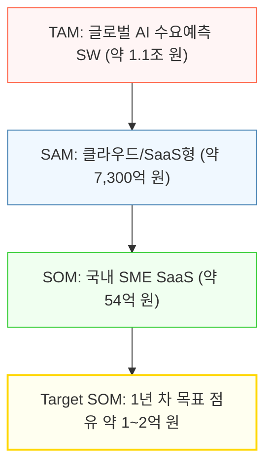
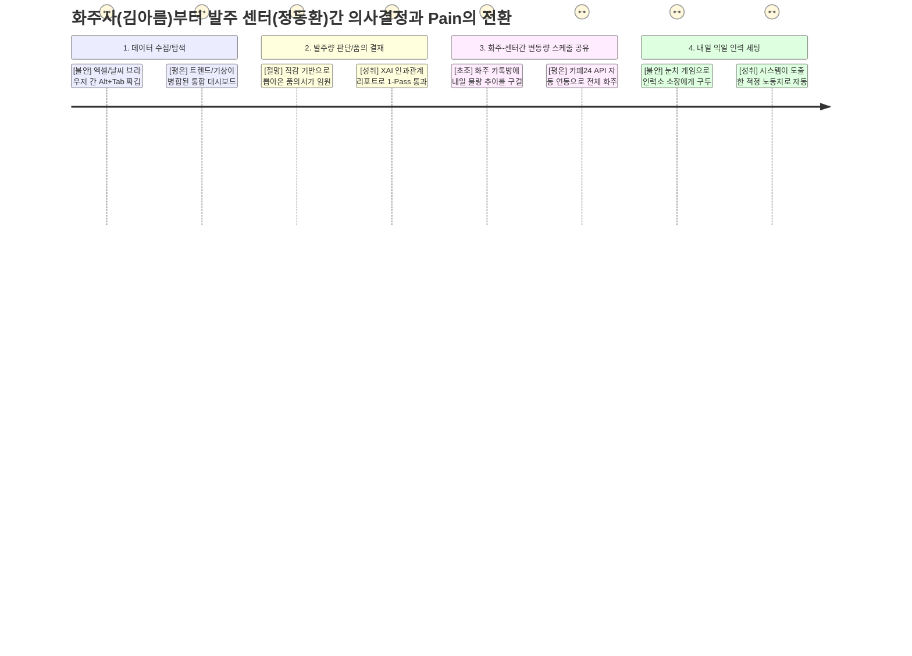
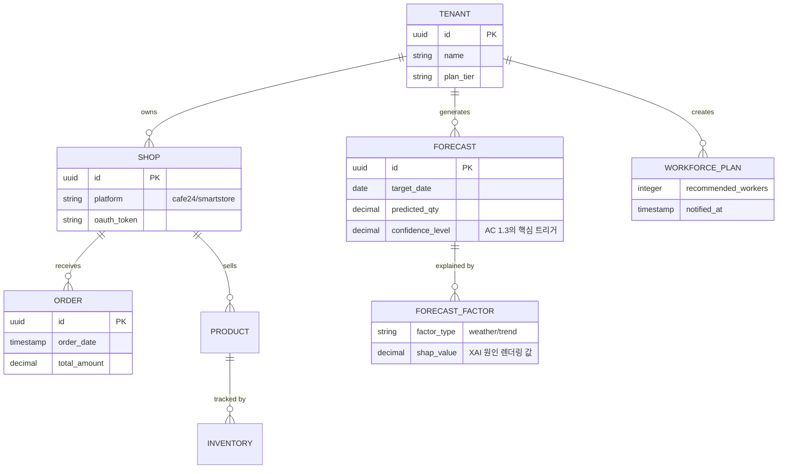
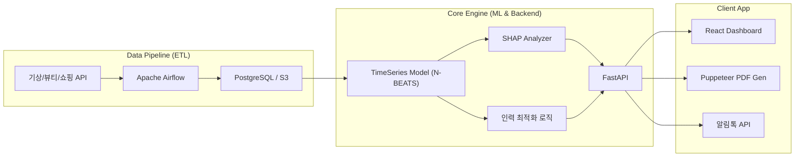

# B2B 수요예측 AI SaaS — 제품 요구사항 명세서 (PRD v1.0)

- **Owner:** Product & AI Engineering
- **최종 업데이트:** 2026-04-16
- **문서 상태:** Draft

> 본 문서는 B2B 고객사(이커머스 및 3PL SME)의 의사결정 프로세스를 지원하기 위한 AI 기반 수요예측 SaaS의 요구사항을 명세합니다. **바이오 콜드체인(IoT 관제) 시나리오는 제품의 Core 정체성을 위해 MVP 전 구간에서 배제되었습니다.**

---

## 1. 개요·목표

### 1-1. 문제 정의 (Pain 지표 포함)

**시장의 구조적 모순 (The Paradox)**
전 세계적으로 AI 솔루션이 범람하지만, 정작 국내 50~100억 매출 규모의 이커머스 SME 실무자 90% 이상은 **여전히 수기 엑셀과 직감에 의존하여 매일 발주와 출고 스케줄을 결정**하고 있습니다. SAP나 Blue Yonder 같은 대형 SCM 솔루션은 수억 원의 초기 도입 비용과 데이터 사이언티스트 조직을 요구하므로 SME에겐 넘을 수 없는 벽입니다. 이 거대한 '정보/도구의 갭' 속에서 매일같이 뼈아픈 재무적 기회손실이 누수되고 있습니다.

**왜 지금인가 (Why Now?)**
숏폼, 틱톡 특가 등 게릴라성 프로모션이 일상화되고 국지성 폭우 등의 극한 기후 변동성이 커지면서, **"과거 몇 년 치 경험치"에 기반한 인간의 직감은 더 이상 유효하지 않은 임계점**에 도달했습니다.

**해결하고자 하는 본질적 Pain & Anxiety**
실무자(MD, 물류센터장)의 진짜 고통은 예측이 한두 번 틀리는 것이 아닙니다. **"수치화할 수 없는 근거로 올린 발주안이 대표에게 수차례 반려당하는 굴욕감"**과 **"만약 수동 예측이 틀려 악성 재고나 품절이 났을 때, 오롯이 자신이 독박 책임을 져야 하는 거대한 불안감(Anxiety)"**입니다. 
우리의 솔루션은 단순한 수치 계산기를 넘어, 투명한 데이터 근거(XAI)를 제공해 경영진 결재를 한 방에 관통시켜 주는 **"의사결정 안전망"**으로 작동합니다.

| 페르소나 | Pain 항목 | 실패 지표 (As-Is) | 기회 손실 규모 |
|---|---|---|---|
| **김아름** (이커머스 MD) | 직감 기반 발주 후 외부 변수 대처 실패로 인한 품절 | 결품률 **15%** | 월 **2,500만 원** |
| **김아름** (이커머스 MD) | 빈약한 근거로 인한 경영진 발주기획 본안 반려 | 품의 반려 월 **5회** | 매일 야근 **4시간** |
| **정동환** (3PL 센터장) | 화주사 기습 프로모션 미공유로 인력 오차율 폭발 | 오버스케줄 낭비율 **20%**| 일 잉여 인건비 **80만 원**|

---

### 1-2. 시장 규모 (TAM / SAM / SOM)

| 구분 | 시장 정의 | 규모 | 근거 |
|---|---|---|---|
| **TAM** | 글로벌 AI 수요예측 소프트웨어 시장 | **약 1조 1,100억 원** | FMI 글로벌 통계 |
| **SAM** | 클라우드/SaaS형 수요예측 시장 | **약 7,300억 원** | TAM × 66% |
| **SOM** | 글로벌+국내 SME 대상 SaaS 시장 | **국내 약 54억 원** | SAM × SME 비중 43% |
| **Target SOM** | 국내 이커머스/물류 SME SaaS (1년 차 타겟) | **약 18~20억 원** | SOM × 이커머스 비중 35% |

---

### 1-3. 목표 (North Star KPI - Leading Metrics 전환)

먼 훗날 측정되는 '재무적 방어율' 대신, 사용자 행동으로 시스템의 성공을 매주 검증하는 **선행 지표(Leading Metrics)**를 북극성(North Star)으로 설정합니다.

| KPI (선행형 북극성 지표) | 측정 기준 및 도구 (Query/Event) | 목표값 |
|---|---|---|
| **권장 리포트 1-Pass 통과율** | XAI 시스템이 만들어준 수치가 경영진을 무수정으로 통과했는가?  (도구: `고객 ERP 연동 로그` 혹은 `주간 Typeform 트래킹`) | **≥ 80% 통과** |
| **발주량 무수정 채택 비율** | 사용자가 시스템이 뽑아준 값을 건드리지 않고 신뢰하는가?  (도구: `Amplitude`, 이벤트: `export_pdf` 시 `edited=false` 비중) | **≥ 80%** |
| **적정 인원 통보 반영률** | 알람을 받은 센터장이 오차 범위 내에서만 인력을 콜업하는가?  (도구: `Mixpanel`, 시스템 산출값 vs `confirmed_workers`) | 오차율 **≤ 5%** |

---

### 1-4. 페르소나별 Outcome KPI

| 유저군 | 도달하고자 하는 상태 (Target Outcome) | As-Is | To-Be | 구간 |
|---|---|---|---|---|
| **이커머스 MD** | 감이 아닌 인과성(XAI)에 의해 결품 손실 통제 | 월 2,500만 원 | **250만 이하** | 월 |
| **이커머스 MD** | 발주를 위한 트렌드, 기상 엑셀 크롤링 노가다 해소 | 일 4시간 야근 | **10분 컷** | 일 |
| **물류센터장** | 오버 스케줄링으로 인한 허공의 일당 손실 최소화 | 발생일 기준 80만 | **16만 이하** | 일 |

---

## 2. 사용자와 페르소나

### 2-1. 핵심 페르소나 요약 및 서사적 일상 프로필

**[Core 1] 👩‍💼 김아름 (36세, B2C/B2B 코스메틱 MD) — *"날씨 엑셀 합치다가 컴퓨터 꺼지면 진짜 다 때려치우고 싶어요"* **
매일 오후 4시, 3개의 엑셀 창(3년 치 사내 매출, 기상청 주간 예보, 네이버 뷰티 트렌드)을 띄워두고 Alt+Tab을 누르며 데이터를 눈으로 대조합니다.
"내일 비가 온다는데 자외선 차단제 발주를 언제, 얼마나 줄여야 하나?" 그녀의 고민은 깊어집니다. 이를 감각적 수치로 적어 올린 결재 본안은 대표의 "이 수치 근거가 뭐야?"라는 질책과 함께 반려됩니다. 지난 성수기, 품절 사태로 시말서를 썼던 기억 때문에 항상 AI가 대신 책임져 주길(Safety Net) 원합니다.

**[Core 2] 👷‍♂️ 정동환 (45세, 3PL 물류센터장) — *"답장 없는 화주들, 어젯밤 부른 알바비는 어디서 보상받나요"* **
10개가 넘는 쇼핑몰 화주들에게 구두 통화나 카톡으로 "내일 기습 프로모션 없으시죠?"라고 묻지만 돌아오는 대답은 없습니다. 
결국 과거 경험을 믿고 일용직 30명을 불렀는데 특정 화주가 몰래 공구를 터뜨려 물량 2천 개가 쏟아졌고, 돈 낭비를 피하려 본인이 직접 새벽 3시까지 까대기를 치며 허리디스크 진단을 받았습니다. 시스템으로 모든 화주사가 통합 컨트롤 되길 바라지만, 화주들이 보안을 핑계로 이탈할까 봐 불안합니다.

※ *권혁수(바이오 콜드체인) 페르소나는 MVP 개발 집중에 방해가 되며 제품 성격을 변질시킬 우려가 높아 향후의 Post-MVP 확장 비전으로 완전히 밀어냈습니다.*

---

### 2-2. 사용자 여정 맵 (As-Is vs To-Be CJM)

---

### 2-3. AOS-DOS 사분면 요약

제품 확장의 모순과 오버엔지니어링을 피하기 위해 AOS(체감 고통)와 DOS(시장 파급력) 매트릭스를 기반으로 기능을 가지치기합니다. 
*   **Q1 혁신 (MoSCoW 우선순위 Must):** 이커머스 MD(김아름), 3PL 물류(정동환)
*   *Q1 극단 (제외 대상):* 바이오 콜드체인(권혁수) - 하드웨어 연계 이슈로 Q4 비전 단계로 임시 강등

---

## 3. 사용자 스토리와 수용 기준 (AC)

> 예외 처리에 집중한 네거티브 AC(Failure Path)를 철저히 시스템에 반영합니다.

### Story 1: 결재 방어용 날씨/트렌드 융합 XAI 리포트 추출

> **As a** 이커머스 MD (김아름),
> **I want** 기상/트렌드 등 외부 변수가 정량화된 XAI 권장 발주 리포트를 추출하여,
> **So that** 경영진 결재를 1번 만에 통과시키고 독박 책임에 대한 심리적 면책을 받을 수 있다.

| AC # | 유형 | 내용 (Given - When - Then) |
|---|---|---|
| **AC 1.1** | Happy | 시스템이 권장 발주 리포트를 렌더링하면, 예측 결괏값 도출에 가장 크게 기여한 **외부 파라미터 Top 3(ex. 강수량 특이점, 공휴일 파급률)가 Shapley 기반 텍스트(설명가능 인공지능)로 치환**되어 표기되어야 한다. |
| **AC 1.2** | Happy | PDF 파일 다운로드 실행 시, **기존 회사의 엑셀 품의서 레이아웃을 최대한 해치지 않는 호환 포맷**으로 출력 가능하여 보수적인 임원진의 레이아웃 거부감을 최소화한다. |
| **AC 1.3** | **Exception** | 내부 연산 결과 **예측 신뢰도 구간(Confidence)이 70% 미만**으로 하락하거나 결측값이 감지될 경우, 발주 버튼 상단에 **[주의: AI 신뢰도가 낮습니다. 반드시 사람이 수동으로 수치를 점검하세요]**라는 경고 배너를 노출하여 사고(Anxiety)를 방지한다. |
| **AC 1.4** | **Exception** | 기상청/네이버 포털 등 통신 데이터가 API 타임아웃 되거나 장애를 일으킬 경우, 직전 성공했던 최신 캐시(최대 24h)로 리포트를 뽑아내되 명확하게 **"금일 실시간 데이터 지연. 어제(날짜) 기준 데이터 반영"** 엠블럼을 찍어주어야 한다. |

---

### Story 2: 파트너 화주 연동 및 인력 자동 스케줄링 대시보드

> **As a** 3PL 물류센터장 (정동환),
> **I want** 파트너 화주사들의 쇼핑몰 API를 우리 센터 대시보드와 자동 연동하여 합산하고,
> **So that** 물량 예측 실패로 인한 오버 스케줄링과 출고 인력 부족 사태를 원천 차단하고 싶다.

| AC # | 유형 | 내용 (Given - When - Then) |
|---|---|---|
| **AC 2.1** | Happy | 화주사 정보를 추가 온보딩 할 때 화주 측의 개발 지원이나 코드 개입을 원천 차단하기 위해 **오직 1-Click 형태의 인증(OAuth 등) 방식만으로 연동**이 완료되어야 한다. |
| **AC 2.2** | Happy | 화주들의 내일 자 출하 예상 합산량에 비례하여 '적정 투입 인용직 인원수'가 역산 도출되고, 매일 오후 4시 정각에 센터장과 인력사무소 소장에게 카카오 알림톡이 동시 전송되어야 한다. |
| **AC 2.3** | **Exception** | 특정 화주 API의 토큰 만료 및 연결 실패 발생 시, 연동이 끊어진 에러를 무시하고 생존한 타 화주들의 데이터만으로 즉시 인원을 산출하되 발송 내용에 **[알림: A상사 데이터 연동 끊김 - 수동 계산 가산 요망]**을 강하게 적색으로 표기한다. |
| **AC 2.4** | **Exception** | 카카오 시스템 오류로 알림톡 파이프라인 전송 실패 시, 1분 이내에 SMS 단문 일반 메시지로 타겟 연락처에 99% Fallback 자동 발송을 성공시켜야 한다. |

---

## 4. 기능 요구사항 (Functional)

### 4-1. MoSCoW 우선순위
*   **Must HAVE (MVP 코어):** 
    *   (F1) XAI(설명 가능한 AI) 해설 엔진 기반의 날씨/매출 융합 발주 리포트 추출기
    *   (F2) 1-Click 기반 이커머스(카페24, 스마트스토어) API 정보 통합 모듈
    *   (F3) 알림톡 기반 일일 적정 노동력(알바) 역산 대시보드
*   **Won't HAVE (배제 기능):**
    *   (F4) 콜드체인 차량 배차 및 온도 이탈 노선 재설정기 (제품 방향성 산란 원인 -> 전면 삭제)
    *   예산 지출 판별 What-IF 시뮬레이터 (추후 확장)

### 4-2. Build / Buy / Partner 기술 내재화 판정
| 기능 파트 | 타겟 스택 | Build / Buy / Partner | 핵심 전략/결정 사유 |
|---|---|---|---|
| 모델링 | 시계열 TFT/앙상블 | **Build** (In-house) | 버티컬 특화 데이터를 다루는 추천 산출 로직 자체는 외부에 의존 시 도메인 경쟁력 소멸 및 마진 하락 우려. |
| PDF추출 | Puppeteer (렌더) | **Buy** (Open-source) | 보편적인 데이터 레이아웃 출력은 외부 라이브러리 엔진을 차용. |
| 알림엔진 | 카카오 비즈 API | **Partner** | B2B 메신저 확장이 아닌 '이미 쓰는 곳에 꽂혀야 하는' Add-on 전략에 부합. |

### 4-3. 차별 및 포지셔닝 전략
경쟁 대안들(SAP, Oracle, Blue Yonder 등의 대형 MLOps 거인들)은 2사분면(범용&통합)에 묶여 있습니다. 
우리는 4사분면(특화&챌린저)에서 출발하여 '이커머스/3PL 특화(1사분면)' 리더로 올라갑니다. 이후 대형 범용 솔루션에 기생(Add-on)하는 API 형태로 침투하여 고객 체류를 유도합니다.

---

## 5. 비기능 요구사항 (NFR)

### 5-1. 성능 및 신뢰성 타겟
| 카테고리 | 제약/조건 |
|---|---|
| **성능 (Performance)** | XAI 리포트 추출 P95 ≤ 10분 이내 종료.  대시보드 페이지 로드 P95 ≤ 2초. |
| **신뢰성 (Reliability)** | 코어 서비스 업타임 월 가용성(SLA) ≥ 99.5%.  예비군/데이터 ETL 파이프라인 실패 시 간격 조율 3회 자동 재시도 룰 세팅. |
| **데이터 결손 대응** | 단일 API 제공사(기상청, 카페24 등)의 분당 Rate Limit 제한 시 배치 큐잉(Queue) 처리. |

### 5-2. 보안 및 프라이버시 제한 (Security NFR)
*   **멀티테넌트 격리 원칙:** 비용 방어상 MVP는 하드웨어 단위의 클러스터 격리 대신 데이터베이스 논리적(스키마) 단일 멀티테넌시 수준으로 격리 조치하되, 접근 제어 토큰(JWT)과 엄격한 권한 분리 레이어를 강하게 둔다.

---

## 6. 데이터·인터페이스 개요 (Data & Interface)

### 6-1. 핵심 엔터티 / ERD 개념
콜드체인을 제외하고, 오직 수발주 및 노동력 역산에 관련된 인프라 엔터티만 다룹니다.

### 6-2. 외부 API 스펙 개요
*   **기상청 (단/중기보):** Rate Limit 고려한 일 1회 메인 배치 덤프 처리.
*   **이커머스 연동 (카페24/스마트스토어):** 주문/재고 조회용 인증(OAuth) 및 실시간 웹훅(Webhook) 혹은 미니 배치 분/시간단위 동기화.
*   **카카오 알림톡:** 템플릿 사전 심사 이후 Fallback(SMS) 로직 동기화 결합.

### 6-3. 기술 스택 & 아키텍처 다이어그램 (고수준)

---

## 7. 리스크, 가정 및 ADR

### 7-1. 주요 리스크 (Risk) 및 우회 요건
*   **[R1. API 연동 저항]** 화주사들이 3PL 창고 시스템에 내밀한 매출 데이터 연동을 꺼릴 수 있음.
    *   *완화 조치:* 복잡도 제로의 '원클릭 인증'을 강조하고, "오버 스케줄링 예방으로 화주의 택배비 패널티를 절감해 줍니다"라는 역마케팅 메시지 소구.
*   **[R2. 데이터 부족 오염]** 신규 고객사의 과거 딥 데이터가 없으면 초기 MVP AI 아웃풋이 형편없음.
    *   *완화 조치:* 도메인 사전 학습된 범용 모델 웨이트 기반 전이학습(Transfer Learning) 적용 및 초반 신뢰도 낮을 시 네거티브 AC(예외 경고) 발동.

### 7-2. ADR (Architecture Decision Record) 핵심 요약
*   **ADR-01. 모델의 자체 내재화:** AWS Forecast 같은 MLaaS를 버리고 자체 TFT/시계열 모델을 태우기로 한 이유는 SHAP 커스텀 변수 추출 등 "결재 보고서를 위한 원인 분석 도출의 극대화"를 달성하기 위함임.
*   **ADR-02. PDF 문서 출력:** 별도로 자체 엔진을 구성하지 않고 웹 UI에 뿌려진 차트를 그대로 렌더 캡처하는 Puppeteer로 낙점하여 엑셀 환경에 익숙한 세대의 체감 만족도를 보장함.

---

## 8. 실험 설계, 통계 및 GTM

### 8-1. 실험 및 검증 기준 (A/B PoC Test)
파일럿 런칭 즉시 통계적 오류와 편향을 없애고 효과의 참거짓 여부를 수학적으로 가설 검정합니다.

| 실험 ID | 검증 가설 / 목적 | 통계적 실험 설계 및 셋업 (Design) | 측정 기준 (Hit Threshold) |
|---|---|---|---|
| **EXP-01** (MD 김아름용 검증) | 기존 직관 대비 투명화된 XAI 리포트 사용 시 상급자로부터 결재 반려 및 의사결정 소요 시간이 단축된다. | **대응 표본 T-검정 (Paired t-test)** • 알파 수준 (α) = 0.05  • 최소 감지 효과(MDE) = 소요 시간 기준 최소 30% 타격 반감 • 표본 수집(n) = 30회 이상의 실제 품의 이력 (사내 4개 고객사 내) | p < 0.05 환경에서 수동 엑셀 대비 평균 소요 시간의 유의미한 통계적 강하 인정 |
| **EXP-02** (센터장 정동환용 검증) | 전체 화주 물량을 자동 API로 취합/최적화할 경우 인건비의 잉여 오버 페널티가 구두 취합 때보다 대폭 축소된다. | **대응 표본 T-검정 (Paired t-test)** • 알파 수준 (α) = 0.05  • 최소 감지 효과(MDE) = 인건비/물량 손실 비율 안정 10%p 개선 • 표본 수집(n) = 파일럿 운영 기간 최소 21 영업일 | 직감적 배치로 날아가던 기회비용 대비 시스템 사용 간 갭(손실 곡선) 축소 입증 |

### 8-2. Go-To-Market(GTM) 포지셔닝 메시징
기존의 타 AI 개발사처럼 "최신 N-BEATS 알고리즘으로 모델 성능 90%"라는 문구를 철저히 금지합니다.
**"상무님 결재 한 시간 만에 받고 퇴근하세요", "이번 달 출고조 인건비 80만 원 아껴 드립니다"** 같은 날것의 B2B ROI(투자 대비 수익) 환산형 언어가 제품 랜딩과 이메일 푸시에 핵심 소구로 쓰여야 합니다.

---

## 9. 근거 (Proof)

이 모든 솔루션과 가설의 출처가 되는 JTBD 인터뷰 실측 및 시장의 외침(근거)입니다.

**JTBD(Jobs-to-be-Done) 초기 인터뷰 핵심 인용**
> *"날씨 엑셀 하나로 합치다 컴다운되면... 아 그냥 다 때려치고 싶다니까요. 내가 비 올 줄 알았나?"* (이커머스 MD 김아름) - 월 손실 2,500만 근원 트리거

> *"화주 이놈들은 물건 팔 땐 말 안 해주고, 배송 지연되면 우리한테 위약금 내놓으래요. 밤마다 전화 돌리는 게 센터장 일입니까?"* (3PL 정동환) - 일 손실 80만 허공 증발 트리거

위 두 개의 육성(Pain)은 우리가 왜 타사처럼 '단순 재고 통합 시스템'을 만들지 않고 **'결재 방어 리포트'**, **'알림톡 기반 스케줄 예측 통보 모듈'**과 같이 사람과 감정에 집중한 UI/기능을 도출했는지 증명하는 근거가 됩니다.

---

## 10. 비즈니스 모델 및 수익 구조 방어 체계

솔루션의 가격 티어는 크게 두 가지 핵심 레이어와 추가 확장 모델로 나뉩니다. 가격 체계는 자산(핵심 엔진 IP)을 지키기 위한 방호벽으로 설계됩니다.

*   **(Tier 1) Basic SaaS (MD 모델):** 날씨/매출/트렌드 XAI 리포트 중심 (예상: 50만 내외 구독)
*   **(Tier 2) Pro SaaS (센터장 모델):** 화주사 무한 연동 모듈 및 알람/인력 역산 결합 패키지 (예상: 150만 이상 구독)
*   **(과금 방어/KFS 추적):** MLOps 체계를 클라이언트에 SI(수주형 개발)로 넘겨 알고리즘을 뺏기지 않고 오직 API 형태와 브라우저 기반 시각화 대시보드로만 통제하여 구독의 영속성을 장가(Lock-in)합니다.

---
*(End of PRD Document)*
