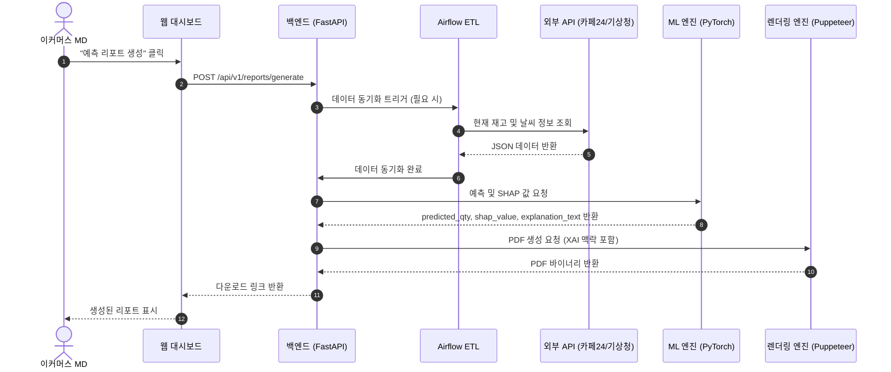
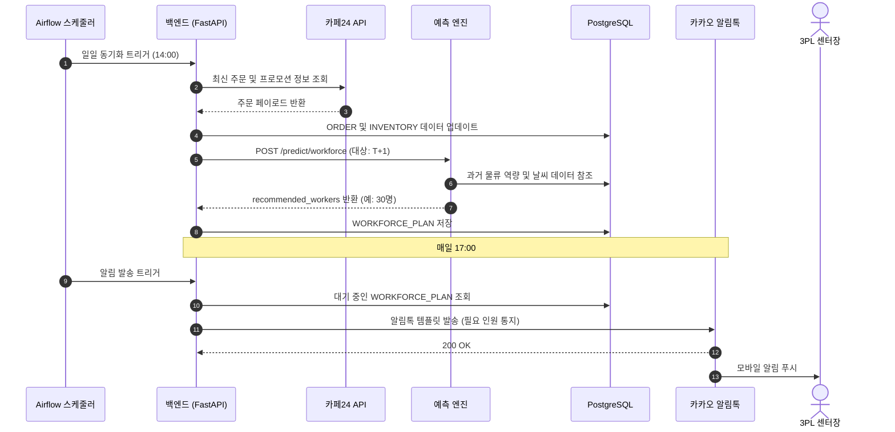

# 소프트웨어 요구사항 명세서 (SRS)
**Document ID:** SRS-001  
**Revision:** 1.0  
**Date:** 2026-04-15  
**Standard:** ISO/IEC/IEEE 29148:2018  

---

## 1. 개요 (Introduction)

### 1.1 목적 (Purpose)
본 소프트웨어 요구사항 명세서(SRS)는 'B2B 수요예측 AI SaaS'의 기능적, 비기능적, 인터페이스, 데이터 및 제약사항을 정의합니다. 본 시스템은 자체 IT 인프라와 데이터 분석 역량이 부족한 B2B 실무 담당자의 핵심 페인 포인트를 해결하는 것을 목적으로 합니다. 외부 환경 변수(날씨, 트렌드, 프로모션)를 설명 가능한 AI(XAI) 엔진에 통합함으로써, 수요예측을 자동화하고 재고를 최적화하며, 일일 정확한 필요 인력 수를 도출하여 결품, 폐기 및 과잉 인건비로 인한 재무적 손실을 방어합니다.

### 1.2 범위 (Scope)
본 문서는 소프트웨어의 MVP(최소 기능 제품) 단계를 다룹니다.

**범위 내 (In-Scope):**
* **F1. 결재 방어용 날씨/트렌드 융합 XAI 원클릭 리포트 추출:** 경영진 승인을 위한 날씨 및 트렌드 데이터가 결합된 설명 가능한 예측 리포트 제공.
* **F2. 쇼핑몰 플랫폼 API 원클릭 연동 모듈:** 카페24, 스마트스토어 등으로부터 OAuth를 통한 자동 데이터 수집.
* **F3. 일일 적정 고용 인원 역산 대시보드:** 예측 출고량을 기반으로 한 일일 필요 아르바이트 인원수 도출.

**범위 외 (Out-of-Scope - Post-MVP):**
* **F4.** 콜드체인 실시간 노선 재설정기.
* **F5.** 예산 지출 연동 What-IF 시뮬레이터.
* **F6.** 모바일 신호등 초간단 발주 UX.

### 1.3 용어 및 정의 (Definitions, Acronyms, Abbreviations)
* **AOS (Adjusted Opportunity Score):** 사용자의 페인 포인트 체감 강도를 나타내는 지표.
* **DOS (Discovered Opportunity Score):** 문제의 시장 파급력 및 확장성을 나타내는 지표.
* **JTBD (Jobs to be Done):** 사용자가 해결하고자 하는 핵심 과업을 정의하는 프레임워크.
* **XAI (Explainable AI):** 인간이 그 동작 원리와 결과를 이해할 수 있도록 설명 가능한 인공지능.
* **SHAP (SHapley Additive exPlanations):** 머신러닝 모델의 출력에 대한 각 변수의 기여도를 계산하는 게임 이론적 접근 방식.
* **SME (Small and Medium Enterprise):** 초기 SaaS 배포의 타겟 시장인 중소기업.
* **3PL (Third-Party Logistics):** 물류 및 공급망 서비스의 외주 전문 업체.

### 1.4 참조 (References)
* **[REF-01]** VPS 원본 참조: `04_VPS-final/06_VPS-Integrated-V2.md`
* **[REF-02]** FMI 2025 글로벌 AI 수요예측 소프트웨어 시장 통계
* **[REF-03]** B2B 수요예측 AI SaaS — PRD v0.1 (Draft)

### 1.5 제약사항 및 가정 (Constraints and Assumptions)
* **Constraint-01 (API 호출 제한):** 기상청 API는 일 1,000회, 카페24 API는 분당 100회로 제한되므로 배치 큐잉이 필수적임.
* **Constraint-02 (비용):** MVP 인프라 운영 비용은 월 5,000,000원 이하여야 함.
* **Assumption-01:** 카페24, 스마트스토어, 기상청 등 외부 API가 향후 12개월간 현재의 스펙과 무료 이용 범위를 유지함.
* **Assumption-02:** LLM 서머라이저가 SHAP 값을 경영진 보고용 공식 문서 톤으로 정확하게 조정할 수 있음.

---

## 2. 이해관계자 (Stakeholders)

| 역할 (Role) | 책임 (Responsibility) | 핵심 관심사 / 페인 포인트 | 우선순위 |
| :--- | :--- | :--- | :--- |
| **이커머스 MD (김아름)** | 재고 관리, 발주 및 경영진 보고 | 결품 및 과발주 방지를 위한 고정밀 리포트 필요. 엑셀 수동 작업 기피. | 핵심 (MVP) |
| **3PL 센터장 (정동환)** | 창고 인력 및 출고 스케줄 관리 | 인건비 낭비와 출고 지연을 막기 위해 화주 프로모션에 기반한 정확한 인원 산출 필요. | 핵심 (MVP) |
| **콜드체인 담당자 (권혁수)** | 온도 민감 물류 노선 관리 | 온도 이탈 리스크 0% 유지 및 유통기한 임박 제품의 폐기 제로화. | 확장 (Post-MVP) |
| **경영진** | 운영 예산 및 일일 발주 승인 | 블랙박스 AI가 아닌, 승인을 정당화할 수 있는 명확한(XAI) 데이터 요구. | 간접 |

---

## 3. 시스템 컨텍스트 및 인터페이스 (System Context and Interfaces)

### 3.1 외부 시스템 (External Systems)
* **기상청:** 단기 및 중기 예보 데이터 제공.
* **네이버 데이터랩:** 키워드별 검색량 트렌드 지수 제공.
* **이커머스 플랫폼 (카페24, 스마트스토어):** 상점 재고, 주문 이력 및 상품 상세 정보 제공.
* **카카오 알림톡:** 인력소 및 센터장 대상 자동 알림 발송.

### 3.2 클라이언트 애플리케이션 (Client Applications)
* **웹 대시보드:** 설정, 실시간 모니터링 및 리포트 생성을 위한 React 기반 프론트엔드.
* **PDF 엔진:** XAI 맥락을 포함한 경영진 결재용 리포트 생성을 위한 Puppeteer 기반 서비스.

### 3.3 API 개요 (API Overview)
FastAPI 백엔드를 활용한 API 중심 아키텍처를 채택합니다.
* **Inbound APIs:** 외부 호스트로부터의 RESTful 요청 처리. 외부 호출 제한을 준수하기 위한 캐싱 레이어 및 Airflow ETL DAG에 의해 관리됨.
* **Internal APIs:** ML 예측 엔드포인트(PyTorch 모델 서빙) 및 PDF 생성 엔드포인트.
* **Outbound APIs:** 카카오 알림톡 발송을 위한 웹훅 및 POST 요청.

### 3.4 상호작용 시퀀스 (Interaction Sequences)

---

## 4. 상세 요구사항 (Specific Requirements)

### 4.1 기능 요구사항 (Functional Requirements)

| 요구사항 ID | 우선순위 | 기능명 | 출처 (Story) | 상세 설명 | 인수 기준 (Acceptance Criteria) |
| :--- | :--- | :--- | :--- | :--- | :--- |
| **REQ-FUNC-001** | Must | F2 | Story 2 | OAuth 인증 플로우 | 플랫폼 연동 페이지에서 사용자가 연동 버튼을 클릭하면 1-click OAuth 플로우가 시작되고 API 토큰이 보안 저장되어야 함. |
| **REQ-FUNC-002** | Must | F2 | Story 2 | 주문/재고 동기화 | 인증된 연결에 대해 정기적 혹은 수동 요청 시 시스템은 플랫폼으로부터 주문 및 재고 데이터를 수집하고 저장해야 함. |
| **REQ-FUNC-003** | Must | F2 | Story 2 | 프로모션 감지 | 동기화된 데이터에서 특정 SKU의 주문이 급증할 경우, 시스템은 이를 프로모션 시그널로 감지하고 플래그를 설정해야 함. |
| **REQ-FUNC-004** | Must | F1 | Story 1 | 예측 실행 | 날씨, 트렌드, 매출 데이터 동기화 완료 시 ML 엔진은 예측 최적 발주량을 계산해야 함. |
| **REQ-FUNC-005** | Must | F1 | Story 1 | XAI 해설 생성 | 예측 결과 생성 시 시스템은 SHAP 값을 계산하고 이를 경영진용 자연어 서머리로 변환해야 함. |
| **REQ-FUNC-006** | Must | F1 | Story 1 | PDF 리포트 생성 | 예측 결과 및 XAI 해설을 포함하여 기존 경영진 결재 양식(엑셀 표 + 텍스트 요약)과 호환되는 PDF를 생성해야 함. |
| **REQ-FUNC-007** | Must | F3 | Story 2 | 필요 인원 산출 | 익일 예측 출고량을 기반으로 물류센터 역량 변수를 적용해 정확한 필요 아르바이트 인원수를 도출해야 함. |
| **REQ-FUNC-008** | Must | F3 | Story 2 | 자동 알림 발송 | 산출된 필요 인원 정보를 매일 17:00에 센터장 및 인력소에 카카오 알림톡으로 자동 발송해야 함. |

### 4.2 비기능 요구사항 (Non-Functional Requirements)

| 요구사항 ID | 카테고리 | 측정 지표 / 표준 | 목표값 | 검증 방법 |
| :--- | :--- | :--- | :--- | :--- |
| **REQ-NF-001** | 성능 | 리포트 생성 소요 시간 (p95) | ≤ 10분 | APM 대시보드 모니터링. |
| **REQ-NF-002** | 성능 | 대시보드 페이지 로드 (p95) | ≤ 2.0초 | RUM (Real User Monitoring). |
| **REQ-NF-003** | 성능 | ML 모델 추론 레이턴시 (p95) | ≤ 30초 | 모델 서빙 로그. |
| **REQ-NF-004** | 성능 | 외부 API 동기화 지연 (p95) | ≤ 5분 | ETL 파이프라인 모니터링. |
| **REQ-NF-005** | 가용성 | 시스템 월 가용성 (SLA) | ≥ 99.5% | CloudWatch 및 Datadog. |
| **REQ-NF-006** | 신뢰성 | ML 추론 오류율 | ≤ 0.5% | 커스텀 대시보드 모니터링. |
| **REQ-NF-007** | 신뢰성 | ETL 파이프라인 폴백 | 실패 시 3회 재시도; 기상청 실패 시 24시간 전 캐시 사용 | Airflow DAG 로그. |
| **REQ-NF-008** | 보안 | 데이터 암호화 | 전송 시 TLS 1.3, 저장 시 AES-256 | 보안 감사. |
| **REQ-NF-009** | 보안 | 테넌트 격리 | 멀티테넌트 DB 스키마를 통한 논리적 격리 | 아키텍처 리뷰. |
| **REQ-NF-010** | 비즈니스 | 리포트 1-pass 결재율 | ≥ 80% | 고객 피드백 루프 및 시스템 추적. |
| **REQ-NF-011** | 비즈니스 | 기회손실 방어율 | ≥ 90% | 월간 재무 실적 비교. |
| **REQ-NF-012** | 비즈니스 | 인건비 절감률 | ≥ 30% | 월간 HR 비용 분석. |
| **REQ-NF-013** | 비용 | 월 인프라 운영 비용 | ≤ 5,000,000 KRW | AWS 빌링 대시보드. |

---

## 5. 추적성 매트릭스 (Traceability Matrix)

| 출처 (Story) | 요구사항 ID | 기능 카테고리 | 테스트 케이스 ID (예시) |
| :--- | :--- | :--- | :--- |
| Story 2 (API 연동) | REQ-FUNC-001 | F2. API 연동 모듈 | TC-F2-01 |
| Story 2 (데이터 동기화) | REQ-FUNC-002 | F2. API 연동 모듈 | TC-F2-02 |
| Story 2 (프로모션 감지) | REQ-FUNC-003 | F2. API 연동 모듈 | TC-F2-03 |
| Story 1 (수요 예측) | REQ-FUNC-004 | F1. XAI 리포트 | TC-F1-01 |
| Story 1 (XAI 해설) | REQ-FUNC-005 | F1. XAI 리포트 | TC-F1-02 |
| Story 1 (결재용 PDF) | REQ-FUNC-006 | F1. XAI 리포트 | TC-F1-03 |
| Story 2 (인원 산출) | REQ-FUNC-007 | F3. 인원 역산 보드 | TC-F3-01 |
| Story 2 (자동 통지) | REQ-FUNC-008 | F3. 인원 역산 보드 | TC-F3-02 |

---

## 6. 부록 (Appendix)

### 6.1 API 엔드포인트 목록

| 엔드포인트 | 메서드 | 방향 | 설명 | 제약사항 |
| :--- | :--- | :--- | :--- | :--- |
| `/api/v1/integrations/oauth` | POST | 내부 | 외부 상점 연동을 위한 OAuth 플로우 시작 | N/A |
| `/api/v1/sync/orders` | POST | 내부 | 주문 동기화를 위한 Airflow DAG 트리거 | 캐싱 처리 |
| `[Cafe24]/api/v2/orders` | GET | Inbound | 카페24로부터 원시 주문 데이터 수집 | 100회/분 |
| `[KMA]/v1/weather/short` | GET | Inbound | 기상청 단기 예보 데이터 수집 | 1,000회/일 |
| `/api/v1/predict/demand` | POST | 내부 | 수요예측을 위한 PyTorch 모델 호출 | GPU 자원 의존 |
| `/api/v1/reports/pdf` | POST | 내부 | Puppeteer를 이용한 PDF 리포트 생성 | 타임아웃 5분 |
| `[Kakao]/v2/alimtalk/send` | POST | Outbound | 아르바이트 필요 인원 통지 발송 | 건당 과금 |

### 6.2 엔터티 및 데이터 모델

| 엔터티 | PK | 속성 (Attributes) | 설명 |
| :--- | :--- | :--- | :--- |
| **TENANT** | `id` (UUID) | `name`, `plan_tier`, `created_at` | SaaS 고객사 계정. |
| **SHOP** | `id` (UUID) | `tenant_id` (FK), `platform`, `oauth_token`, `status` | 연동된 쇼핑몰 플랫폼 정보. |
| **PRODUCT** | `id` (UUID) | `shop_id` (FK), `sku`, `name`, `category` | 관리 대상 상품 아이템. |
| **ORDER** | `id` (UUID) | `shop_id` (FK), `platform_order_id`, `order_date`, `is_promotion` | 수집된 판매 주문 데이터. |
| **INVENTORY** | `id` (UUID) | `product_id` (FK), `current_qty`, `safety_stock` | 현재 재고 수준 관리. |
| **FORECAST** | `id` (UUID) | `tenant_id` (FK), `target_date`, `predicted_qty`, `model_version` | 생성된 수요 예측 기록. |
| **FORECAST_FACTOR** | `id` (UUID) | `forecast_id` (FK), `factor_type`, `shap_value`, `explanation_text` | XAI 기여도 및 해설 텍스트. |
| **WORKFORCE_PLAN** | `id` (UUID) | `tenant_id` (FK), `target_date`, `predicted_shipments`, `recommended_workers` | 도출된 일일 필요 인력 계획. |

### 6.3 상세 상호작용 모델

**시퀀스 다이어그램: 인력 산출 및 자동 통지 파이프라인 (F2 & F3)**

---

## 7. 검증 및 타당성 확인 (Verification & Validation)

본 섹션에서는 요구사항이 올바르게 구현되었는지 확인(Verification)하고 비즈니스 목표를 달성하는지 검증(Validation)하는 계획을 기술합니다.

### 7.1 검증 방법론 (Verification Methods)
* **Inspection (I):** 시각적 확인이나 문서 검토.
* **Analysis (A):** 수학적 모델링이나 연산 결과 확인.
* **Demonstration (D):** 시스템 작동 과정을 통한 기능 확인.
* **Test (T):** 정밀한 입력값에 대한 출력값 대조 및 성능 측정.

### 7.2 실험 및 검증 설계 (Verification & Validation Matrix)

| ID | 검증 항목 | 방법 | 성공 기준 (Success Criteria) | 관련 REQ ID |
| :--- | :--- | :---: | :--- | :--- |
| **VAL-EXP-01** | XAI 리포트 결재 통과율 | D, T | 파일럿 고객 MD 대상 1-pass 결재율 ≥ 80% | REQ-FUNC-006 |
| **VAL-EXP-02** | 인건비 절감 효율 | A, T | 3PL 센터 오버 스케줄링 감소로 인건비 ≥ 30% 절감 | REQ-FUNC-007 |
| **VAL-EXP-03** | API 연동 편의성 | D | 1-click OAuth 연동 성공률 ≥ 95% | REQ-FUNC-001 |
| **VAL-EXP-04** | 예측 정확도 (MAPE) | A | 시스템 MAPE < 기존 엑셀 수기 MAPE × 0.7 | REQ-FUNC-004 |
| **VAL-EXP-05** | XAI 해설 만족도 | I | 사용자 만족도 5점 척도 중 ≥ 4.0 (A/B 테스트) | REQ-FUNC-005 |

---

## 8. 비즈니스 및 운영 요구사항 (Business & Operational Requirements)

### 8.1 요금제별 권한 제어 (REQ-BUS)

| ID | 우선순위 | 구분 | 요구사항 설명 |
| :--- | :---: | :--- | :--- |
| **REQ-BUS-001** | Must | Basic | 월 50~100만 원 구독자: 웹 대시보드 및 XAI PDF 리포트 권한 부여. |
| **REQ-BUS-002** | Must | Pro | 월 100~200만 원 구독자: Basic + API 연동 및 인원 역산 권한 부여. |
| **REQ-BUS-003** | Should | Premium | 콜드체인 대상: Pro + 실시간 노선 재설정 및 법적 로그 제공. |
| **REQ-BUS-004** | Could | Headless | 데이터 조직 대상: UI 제외, 예측 엔진 API 납품 모델 지원. |

---

## 9. 리스크 및 의존성 관리 (Risk & Dependency Management)

### 9.1 기술 및 비즈니스 리스크 (REQ-RSK)

| ID | 리스크 항목 | 영향도 | 대응 전략 |
| :--- | :--- | :---: | :--- |
| **REQ-RSK-001** | 외부 API 호출 제한 | High | 배치 큐잉 적용 및 최근 24시간 데이터 캐시 폴백 운영. |
| **REQ-RSK-002** | 데이터 부족 (Cold Start) | High | 합성 데이터(Synthetic Data) 및 전이학습 병행. |
| **REQ-RSK-003** | API 스펙 변경 | High | API 버전 관리 체계 구축 및 어댑터 즉각 업데이트. |
| **REQ-RSK-004** | 실무자 책임 공포 | High | 인간-in-the-loop 최종 승인 및 XAI 근거 품질 강화. |

### 9.2 시스템 의존성 (Dependencies)
* **DEP-01:** 인원 역산 기능(F3)은 쇼핑몰 API 연동(F2) 데이터 선행 수집에 의존함.
* **DEP-02:** XAI 해설 품질은 LLM 서머라이저의 한국어 비즈니스 톤 조정 성능에 의존함.

---

## 10. 개념 증명 근거 (Proof of Concept Evidence)

### 10.1 페르소나별 Pain Point 수치
* **이커머스 MD:** 월 결품률 15%, 월 기회 손실액 **약 2,500만 원**.
* **3PL 센터장:** 인원 산출 부재로 인한 허공 인건비 **일 80만 원**.
* **콜드체인:** 유통기한/온도 사고 발생 시 **회당 3억~10억 원** 폐기.

### 10.2 기회 지표 (AOS-DOS)
* **품절 손실 방어:** DOS 2.7 (최우선 혁신 영역).
* **인원 오차 방어:** DOS 2.0 (핵심 혁신 영역).
* **온도 이탈 방어:** DOS 1.6 (프리미엄 니치 영역).

---
*End of Full SRS Document (Korean Edition)*