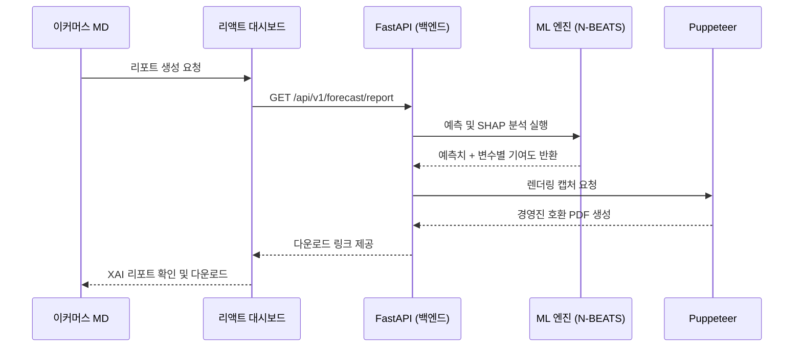
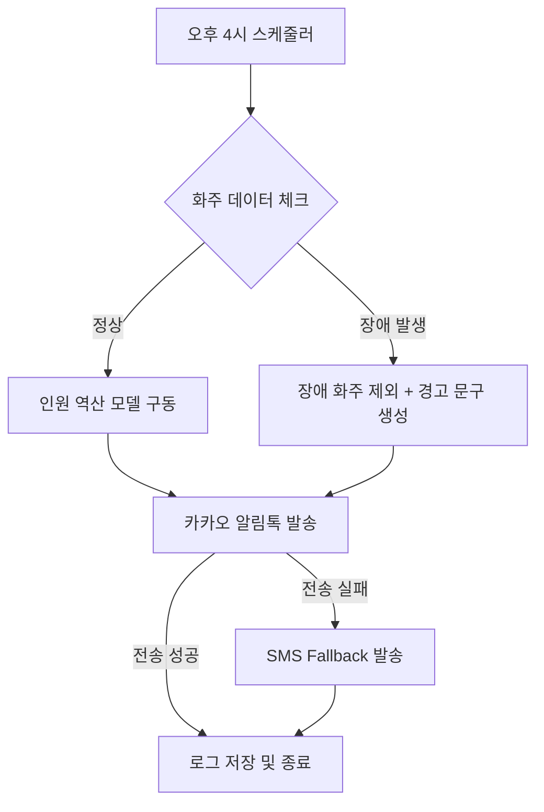

제안해주신 출력 구조와 10가지 필수 규칙은 ISO/IEC/IEEE 29148:2018 표준을 준수하면서도, 새롭게 업데이트된 PRD v1.0의 날카로운 비즈니스 로직을 담아내기에 매우 적합합니다. 검토 결과, 다음과 같은 핵심 변경 사항을 반영하여 동일한 구조로 SRS를 재작성하는 것이 타당합니다.

**검토 및 반영 전략:**
1.  **스코프 정제:** '바이오 콜드체인' 관련 명세를 완전히 삭제하여 제품의 핵심(Core)인 이커머스 MD와 3PL 센터장 시나리오에 집중합니다.
2.  **예외 처리 요구사항 강화:** PRD v1.0에서 강조된 '네거티브 AC(신뢰도 하락, API 장애, 전송 실패)'를 독립적인 기능 요구사항(REQ-FUNC)으로 격상합니다.
3.  **선행 지표 기반 검증:** 재무적 결과가 아닌 '1-Pass 통과율', '무수정 채택률' 등을 비기능 요구사항(REQ-NF)의 핵심 측정 지표로 설정합니다.
4.  **통계적 신뢰성:** 8장의 실험 설계 내용을 5장 및 7장(부록)에 반영하여 개발 단계부터 통계적 검증이 가능하도록 구성합니다.

준비가 되셨다면, 이 기준들을 적용하여 생성한 새로운 SRS 문서를 확인해 보시기 바랍니다.

# Software Requirements Specification (SRS)
Document ID: SRS-002
Revision: 1.0
Date: 2026-04-16
Standard: ISO/IEC/IEEE 29148:2018

---

## 1. Introduction

### 1.1 Purpose
본 문서는 이커머스 및 3PL SME 실무자의 의사결정 프로세스를 지원하기 위한 'B2B 수요예측 AI SaaS'의 소프트웨어 요구사항을 정의합니다. 본 시스템은 단순한 수치 계산을 넘어, 설명 가능한 AI(XAI)를 통해 경영진의 결재를 원활하게 하고 실무자의 심리적 불안감(Anxiety)을 해소하는 '의사결정 안전망' 역할을 수행합니다.

### 1.2 Scope (범위)
**In-Scope (MVP 핵심 기능):**
* **F1:** 날씨/트렌드 융합 XAI 리포트 추출기 (결재 방어용).
* **F2:** 1-Click 기반 쇼핑몰(카페24, 스마트스토어) API 통합 모듈.
* **F3:** 알림톡 기반 일일 적정 노동력(알바) 역산 대시보드.

**Out-of-Scope (배제 대상):**
* 바이오 콜드체인(IoT 관제) 시나리오 및 관련 하드웨어 연계 기능 (전 구간 배제).
* 예산 지출 판별 What-IF 시뮬레이터 (Post-MVP 확장 과제).

### 1.3 Definitions, Acronyms, Abbreviations
* **XAI (Explainable AI):** 예측 결과의 원인을 인간이 이해할 수 있도록 설명하는 기술.
* **SHAP (Shapley Additive Explanations):** 각 변수가 예측값에 미친 기여도를 산출하는 모델링 기법.
* **1-Pass 통과:** 실무자의 기안이 수정 없이 경영진에 의해 즉시 승인되는 상태.
* **Leading Metrics (선행 지표):** 최종 재무 결과 이전에 시스템의 성공 여부를 예측할 수 있는 행동 지표.

### 1.4 References
* **REF-01:** B2B 수요예측 AI SaaS — 제품 요구사항 명세서 (PRD v1.0).
* **REF-02:** ADR-01 (모델 자체 내재화 결정 기록).
* **REF-03:** ADR-02 (Puppeteer 기반 PDF 출력 결정 기록).

---

## 2. Stakeholders

| 역할 (Role) | 책임 (Responsibility) | 관심사 및 페인 포인트 (Interest/Pain) |
| :--- | :--- | :--- |
| **이커머스 MD (김아름)** | 발주 및 재고 관리, 경영진 품의 | 데이터 수집 노가다 해소, 결재 반려에 따른 심리적 굴욕감 및 책임 불안 해소. |
| **3PL 센터장 (정동환)** | 인력 스케줄링 및 물동량 관리 | 화주사 프로모션 누락 방지, 오버 스케줄링에 따른 인건비 낭비 차단. |
| **인력사무소 소장** | 일용직 인력 공급 | 정확한 인원 수요 예측에 기반한 적시 인력 배치. |
| **경영진 (의사결정자)** | 예산 승인 및 성과 관리 | 발주 수치의 명확한 근거(인과관계) 확인, 재무적 ROI 극대화. |

---

## 3. System Context and Interfaces

### 3.1 External Systems
* **기상청/포털 API:** 단/중기 예보 및 트렌드 데이터 수집.
* **이커머스 호스팅 (카페24/스마트스토어):** 주문/재고 데이터 동기화.
* **카카오 비즈 API:** 센터장 및 인력소 대상 알림톡 전송.

### 3.2 Client Applications
* **React Dashboard:** 실무자용 데이터 시각화 및 제어 인터페이스.
* **Puppeteer PDF Generator:** 웹 UI 차트를 렌더링하여 경영진 보고용 PDF 생성.

### 3.3 API Overview (핵심 인터페이스)
* **Sync API:** 외부 API(기상, 쇼핑몰)로부터 데이터를 수집하며 Rate Limit 초과 시 배치 큐잉 처리.
* **Forecast API:** 내재화된 N-BEATS/TFT 모델을 통해 예측값 및 SHAP 기여도 산출.

### 3.4 Interaction Sequences (핵심 시퀀스)

---

## 4. Specific Requirements

### 4.1 Functional Requirements (기능 요구사항)

| 요구사항 ID | 우선순위 | 소스 (Story) | 상세 요구사항 설명 | 인수 기준 (Acceptance Criteria) |
| :--- | :--- | :--- | :--- | :--- |
| **REQ-FUNC-101** | Must | Story 1 | **XAI 기반 리포트 생성:** 예측치 도출에 기여한 외부 변수 Top 3를 자연어로 설명해야 함. | 리포트 내 기상 특이점, 공휴일 파급률 등이 SHAP 기반 텍스트로 명시됨. |
| **REQ-FUNC-102** | Must | Story 1 | **결재 호환 PDF 출력:** 기존 엑셀 품의서 양식을 유지한 레이아웃으로 출력되어야 함. | 생성된 PDF가 기존 경영진 승인 포맷과 90% 이상 일치함. |
| **REQ-FUNC-103** | Must | Story 1 | **[Exception] 신뢰도 경고:** 예측 신뢰도가 70% 미만일 경우 시스템은 경고를 표시해야 함. | 예측값 상단에 "AI 신뢰도 낮음, 수동 점검 필요" 배너 노출. |
| **REQ-FUNC-104** | Must | Story 1 | **[Exception] 데이터 캐시 폴백:** API 장애 시 최신 캐시 데이터를 반영하고 이를 명시해야 함. | "금일 실시간 데이터 지연, 어제 기준 데이터 반영" 엠블럼 표기. |
| **REQ-FUNC-201** | Must | Story 2 | **1-Click OAuth 연동:** 화주사 연동 시 개발 개입 없이 인증만으로 완료되어야 함. | 1-Click 인증 완료 후 주문/재고 데이터 동기화 시작. |
| **REQ-FUNC-202** | Must | Story 2 | **[Exception] 연동 실패 대응:** 특정 화주 연동 중단 시 타 화주 데이터만으로 인원 산출을 강행함. | "A상사 연동 끊김 - 수동 가산 요망" 메시지를 적색으로 표기. |
| **REQ-FUNC-301** | Must | Story 2 | **인력 역산 및 알림 통보:** 예측 출하량 대비 적정 인원수를 도출하여 알림톡을 발송함. | 매일 16:00 정각에 센터장/인력소에 카카오 알림톡 동시 전송. |
| **REQ-FUNC-302** | Must | Story 2 | **[Exception] 알림톡 Fallback:** 알림톡 발송 실패 시 SMS로 즉시 전환 발송해야 함. | 전송 실패 후 1분 이내에 SMS 단문 일반 메시지 자동 발송. |

### 4.2 Non-Functional Requirements (비기능 요구사항)

| 요구사항 ID | 분류 | 세부 지표 및 제약사항 | 목표치 |
| :--- | :--- | :--- | :--- |
| **REQ-NF-401** | 성능 | XAI 리포트 추출 완료 시간 (P95) | ≤ 10분 |
| **REQ-NF-402** | 성능 | 대시보드 페이지 로드 속도 (P95) | ≤ 2초 |
| **REQ-NF-403** | 가용성 | 코어 서비스 월간 가용성 (SLA) | ≥ 99.5% |
| **REQ-NF-404** | 신뢰성 | 선행 지표: 권장 리포트 1-Pass 통과율 | ≥ 80% |
| **REQ-NF-405** | 신뢰성 | 선행 지표: 발주량 무수정 채택 비율 | ≥ 80% |
| **REQ-NF-406** | 운영 | 인력 역산 결과에 따른 실제 인력 콜업 오차율 | ≤ 5% |
| **REQ-NF-407** | 보안 | 멀티테넌트 데이터 격리 (논리적 스키마 격리) | 데이터베이스 스키마 단위 분리 |

---

## 5. Traceability Matrix

| Story ID | Requirement ID | Test Case ID | Verification Method |
| :--- | :--- | :--- | :--- |
| Story 1 | REQ-FUNC-101, 102 | TC-XAI-01 | Demonstration (리포트 렌더링 확인) |
| Story 1 | REQ-FUNC-103, 104 | TC-ERR-01 | Analysis (에러 상황 시뮬레이션) |
| Story 2 | REQ-FUNC-201 | TC-AUTH-01 | Test (OAuth 인증 성공 여부) |
| Story 2 | REQ-FUNC-301, 302 | TC-NOTI-01 | Demonstration (16:00 발송 및 Fallback) |

---

## 6. Appendix

### 6.1 Entity & Data Model

| Entity | Description | 주요 필드 |
| :--- | :--- | :--- |
| **TENANT** | 고객사 (고객사별 격리 단위) | id, name, plan_tier |
| **SHOP** | 연동된 쇼핑몰 플랫폼 정보 | id, platform, oauth_token |
| **FORECAST** | 생성된 예측 데이터 및 신뢰도 지표 | target_date, predicted_qty, confidence_level |
| **FORECAST_FACTOR** | XAI 원인 분석 데이터 (SHAP) | factor_type, shap_value |
| **WORKFORCE_PLAN** | 인력 계획 및 통보 이력 | recommended_workers, notified_at |

### 6.2 Detailed Interaction Models (상세 시퀀스 - 인력 통보)

### 6.3 Validation Plan (검증 계획)
* **실험 설계:** 파일럿 고객사 4곳을 대상으로 21 영업일간 대응 표본 T-검정(Paired t-test) 실시.
* **성공 판단:** 유의 수준(p) < 0.05 환경에서 수동 엑셀 대비 소요 시간 30% 이상 강하 입증 시 성공으로 판정.