# Software Requirements Specification (SRS)

**Document ID:** SRS-001  
**Revision:** 1.0  
**Date:** 2026-04-15  
**Standard:** ISO/IEC/IEEE 29148:2018  

---

| 항목 | 내용 |
|---|---|
| **프로젝트명** | B2B 수요예측 AI SaaS |
| **작성자** | Senior Requirements Engineer |
| **승인 상태** | Draft — 이해관계자 리뷰 대기 |
| **PRD 원본** | PRD-v0.1 (2026-04-15) |

---

## 1. Introduction

### 1.1 Purpose

본 SRS는 **B2B 수요예측 AI SaaS** 시스템의 소프트웨어 요구사항을 정의한다.

본 시스템은 다음 문제를 해결한다:

> 자체 IT 인프라나 고급 데이터 개발 조직이 없어 수요 관리에 취약하지만, 폭발하는 외부 환경 변동성에 매일 맨몸으로 맞서야 하는 B2B 실무 담당자가, 날씨·유통기한·트렌드·돌발 프로모션 등 예측하기 힘든 외부 변수를 즉각 반영하여 당일 발주량 및 창고 알바 인원 스케줄을 결정해야 하는 상황에서, 기존 수기 엑셀의 한계와 AI 블랙박스 불투명성으로 인해 대규모 결품·악성 재고 폐기가 발생하여 영업이익이 훼손되는 문제를 해결한다.

본 문서의 대상 독자는 개발 팀, QA 팀, 프로젝트 관리자, 사업 이해관계자이다.

### 1.2 Scope

#### 1.2.1 In-Scope (MVP)

| ID | 항목 | 설명 | PRD 참조 |
|---|---|---|---|
| SCOPE-IN-01 | F1. XAI 원클릭 리포트 추출 | 기상·트렌드·매출 변수가 융합된 XAI 발주 권장 PDF 리포트 자동 생성 | PRD §4-1 F1, §7-1 |
| SCOPE-IN-02 | F2. 쇼핑몰 API 원클릭 연동 모듈 | 카페24·스마트스토어 등 쇼핑몰 플랫폼 OAuth 기반 1-click 연동 | PRD §4-1 F2, §7-1 |
| SCOPE-IN-03 | F3. 적정 고용 인원 역산 대시보드 | 예측 출고량 기반 일용직 알바 적정 인원 산출 및 자동 알림 | PRD §4-1 F3, §7-1 |

#### 1.2.2 Out-of-Scope

| ID | 항목 | 복귀 조건 | PRD 참조 |
|---|---|---|---|
| SCOPE-OUT-01 | F4. 콜드체인 실시간 노선 재설정기 | MVP(F1~F3) 매출 안정화 후 파일럿 고객 1곳 확보 시 착수 | PRD §7-2 |
| SCOPE-OUT-02 | F5. 예산 지출 연동 What-IF 시뮬레이터 | 기존 인프라 재활용 가능 확인 시 | PRD §7-2 |
| SCOPE-OUT-03 | F6. 모바일 신호등 초간단 발주 UX | PC 버전 UI 안정화 이후 모바일 래핑 | PRD §7-2 |
| SCOPE-OUT-04 | 박영자·송미란 대상 기능 | Q4 과잉투자 배제 — MVP 반영 금지 | PRD §4-1 Won't |

#### 1.2.3 Constraints

| ID | 제약사항 | PRD 참조 |
|---|---|---|
| CON-01 | 기상청 단기예보 API Rate Limit: 1,000회/일 — 배치 큐잉 필수 | PRD §6-2, §7-3 R1 |
| CON-02 | 카페24 API Rate Limit: 분당 100회 — 캐시 레이어 필수 | PRD §6-2, §7-3 R2 |
| CON-03 | MVP 기간 인프라 월 비용 ≤ 500만 원 (AWS 스타트업 크레딧 활용) | PRD §5-3 |
| CON-04 | F3(인원 역산)은 F2(API 연동 모듈) 선행 완료 필수 | PRD §7-4 의존성 1 |
| CON-05 | PDF 리포트 양식은 파일럿 고객의 기존 결재 양식 수집 후 확정 | PRD §7-4 의존성 3 |
| CON-06 | XAI 해설 품질은 LLM 서머라이저의 한국어 경영진 톤 조정 성능에 의존 | PRD §7-4 의존성 2 |
| CON-07 | 코어 예측 알고리즘은 SaaS API 과금 모델로 IP 보호 — 소스코드 외부 노출 금지 | PRD §5-3 |
| CON-08 | GPU 서빙 인스턴스 가용성에 의존 (예측 엔진 API) | PRD §6-2 |

#### 1.2.4 Assumptions

| ID | 가정 | PRD 참조 |
|---|---|---|
| ASM-01 | 카페24·스마트스토어 API가 현재 스펙대로 최소 12개월 유지된다 | PRD §7-4 가정 1 |
| ASM-02 | 기상청 단기예보 API 무료 이용이 MVP 기간 동안 지속된다 | PRD §7-4 가정 2 |
| ASM-03 | 파일럿 고객(2사)이 Sprint 3 시작 전까지 확보 가능하다 | PRD §7-4 가정 3 |
| ASM-04 | AWS 스타트업 크레딧으로 초기 인프라 비용을 자체 부담 없이 운영 가능하다 | PRD §7-4 가정 4 |

### 1.3 Definitions, Acronyms, Abbreviations

| 용어 | 정의 | PRD 참조 |
|---|---|---|
| **JTBD (Jobs to be Done)** | 사용자가 특정 상황에서 달성하고자 하는 핵심 과업 | PRD §2, §3 |
| **AOS (Adjusted Opportunity Score)** | 사용자 체감 Pain 강도를 반영한 기회 점수. 공식: Importance + max(Importance − Satisfaction, 0) | PRD §2-3 |
| **DOS (Discovered Opportunity Score)** | 시장 파급력을 반영한 기회 점수. AOS × 시장 크기·빈도 가중치 | PRD §2-3 |
| **XAI (Explainable AI)** | 예측 결과에 대해 변수별 기여도를 인간이 이해 가능한 형태로 제시하는 AI 기술 | PRD §4-2 F1 |
| **SHAP (SHapley Additive exPlanations)** | 개별 예측에 대한 변수별 기여도를 산출하는 XAI 기법 | PRD §4-2 F1 |
| **TFT (Temporal Fusion Transformer)** | 시계열 예측 특화 딥러닝 아키텍처 | PRD §6-3 |
| **N-BEATS** | Neural Basis Expansion Analysis for Time Series. 시계열 예측 딥러닝 모델 | PRD §6-3 |
| **MoSCoW** | Must / Should / Could / Won't 우선순위 분류 체계 | PRD §4-1 |
| **MAPE (Mean Absolute Percentage Error)** | 예측 정확도 측정 지표. 실제값 대비 예측 오차의 절대 백분율 평균 | PRD §8-3 |
| **ETL (Extract, Transform, Load)** | 데이터 추출·변환·적재 파이프라인 | PRD §6-3 |
| **멀티테넌트** | 단일 인프라에서 복수 고객(테넌트)의 데이터를 논리적으로 격리하여 운영하는 구조 | PRD §5-3 |
| **RUM (Real User Monitoring)** | 실제 사용자 브라우저에서 측정하는 성능 모니터링 기법 | PRD §5-1 |
| **1-pass 결재** | 경영진 품의서가 반려 없이 1회에 승인되는 것 | PRD §1-3 |
| **Validator** | JTBD 인터뷰를 통해 Pain 및 기회를 검증하는 대상자 | PRD §9-1 |
| **Persona** | 시스템의 핵심 사용자 유형을 대표하는 가상의 인물 프로파일 | PRD §2-1 |

### 1.4 References

| ID | 문서 / 출처 | 설명 |
|---|---|---|
| **REF-01** | PRD v0.1 (2026-04-15) | 본 SRS의 원천 문서 (Product Requirements Document) |
| **REF-02** | VPS Integrated V2 (`04_VPS-final/06_VPS-Integrated-V2.md`) | Value Proposition Sheet — 페르소나, AOS/DOS, KSF, 가치 사슬 분석 |
| **REF-03** | ISO/IEC/IEEE 29148:2018 | Systems and software engineering — Life cycle processes — Requirements engineering |
| **REF-04** | FMI 2025 글로벌 AI 수요예측 시장 보고서 | TAM 약 8.3억 달러 근거 |
| **REF-05** | 기상청 단기예보 API 공식 문서 | API 스펙, Rate Limit, 응답 포맷 |
| **REF-06** | 카페24 Open API 공식 문서 | 주문/재고 API 스펙, OAuth 2.0, Rate Limit |
| **REF-07** | 네이버 스마트스토어 커머스 API 공식 문서 | 주문/상품 API 스펙, 인증 |
| **REF-08** | 네이버 DataLab 검색어 트렌드 API 공식 문서 | 검색량 지수 API 스펙 |
| **REF-09** | 카카오 알림톡 API 공식 문서 | 발송 API, 템플릿 관리, 과금 체계 |
| **REF-10** | JTBD 인터뷰 원본 (VPS §1-9) | 김아름·권혁수·정동환 인터뷰 증거 |

---

## 2. Stakeholders

| ID | 역할 (Role) | 대표 페르소나 | 책임 (Responsibility) | 관심사 (Interest) | PRD 참조 |
|---|---|---|---|---|---|
| STK-01 | 이커머스 MD | 김아름 | 외부 변수 반영 발주량 결정, 경영진 결재 품의서 작성 | 결품/과발주 기회손실 방어, 야근 시간 단축, 결재 1-pass 달성 | PRD §2-1, DOS 2.7 |
| STK-02 | 3PL 물류센터장 | 정동환 | 화주사 출고량 기반 일용직 인원 확정, 출고 관리 | 오버 스케줄링 인건비 절감, 출고 지연 방지, 화주 클레임 제로 | PRD §2-1, DOS 2.0 |
| STK-03 | 바이오 콜드체인 관리자 | 권혁수 | 온도·유통기한 기반 배송 관리 (Post-MVP) | 의약품 폐기 사고 제로, 법적 추적 가능 로그 | PRD §2-1, DOS 1.6 |
| STK-04 | 경영진 | — | 발주 품의서 최종 승인 | XAI 해설 기반 의사결정 근거의 투명성 | PRD §3 Story 1 AC-2 |
| STK-05 | 화주사 | — | 판매/프로모션 데이터 API 연동 제공 | 배송 지연 감소, 연동 편의성 | PRD §3 Story 2 AC-4 |
| STK-06 | 시스템 관리자 | — | 플랫폼 운영, 모니터링, 장애 대응 | 시스템 가용성 ≥ 99.5%, 모니터링 알림 | PRD §5-4 |
| STK-07 | Product & AI Engineering 팀 | — | 시스템 설계, 개발, 배포, ML 모델 학습 | 기술 부채 최소화, 코어 IP 보호 | PRD Owner 팀 |

---

## 3. System Context and Interfaces

### 3.1 External Systems

| ID | 시스템 | 유형 | 프로토콜 | 설명 | PRD 참조 |
|---|---|---|---|---|---|
| EXT-01 | 기상청 단기예보 API | Inbound | REST/HTTPS | 지역별 기온·강수·풍속 데이터 수집. Rate Limit 1,000회/일 | PRD §6-2, REF-05 |
| EXT-02 | 기상청 중기예보 API | Inbound | REST/HTTPS | 3~10일 예보 데이터 수집. 업데이트 주기 6시간 | PRD §6-2 |
| EXT-03 | 카페24 주문/재고 API | Inbound | REST/HTTPS (OAuth 2.0) | 쇼핑몰 주문·재고 데이터 수집. Rate Limit 분당 100회 | PRD §6-2, REF-06 |
| EXT-04 | 스마트스토어 API | Inbound | REST/HTTPS (OAuth 2.0) | 쇼핑몰 주문·상품 데이터 수집 | PRD §6-2, REF-07 |
| EXT-05 | 네이버 DataLab 트렌드 API | Inbound | REST/HTTPS | 키워드 검색량 지수 수집. 일 25,000회 | PRD §6-2, REF-08 |
| EXT-06 | 카카오 알림톡 API | Outbound | REST/HTTPS | 인력소·센터장 자동 알림 발송. 건당 과금, 템플릿 사전 승인 | PRD §6-2, REF-09 |
| EXT-07 | AWS 클라우드 인프라 | Infrastructure | — | EC2/S3/RDS/CloudWatch. 스타트업 크레딧 활용 | PRD §6-3, §5-3 |

### 3.2 Client Applications

| ID | 클라이언트 | 기술 | 설명 |
|---|---|---|---|
| CLI-01 | 웹 대시보드 | React + Recharts | 예측 결과 시각화, 인원 역산 대시보드, KPI 모니터링 |
| CLI-02 | PDF 리포트 뷰어 | Puppeteer 생성 PDF | 경영진 결재용 XAI 발주 권장 리포트 |

### 3.3 API Overview

| ID | API 명 | 방향 | 메서드 | 엔드포인트 (개요) | 입력 | 출력 | PRD 참조 |
|---|---|---|---|---|---|---|---|
| API-INT-01 | 예측 엔진 API | Internal | POST | `/api/v1/forecast` | 수집 데이터 + 파라미터 | 예측값 + SHAP 해설 JSON | PRD §6-2 |
| API-INT-02 | PDF 리포트 API | Internal | POST | `/api/v1/report/generate` | 예측 결과 + 템플릿 ID | PDF 바이너리 | PRD §6-2 |
| API-INT-03 | 쇼핑몰 연동 API | Internal | POST/GET | `/api/v1/integration/shop` | OAuth 토큰, 플랫폼 유형 | 연동 상태 JSON | PRD §6-2 |
| API-INT-04 | 인원 역산 API | Internal | POST | `/api/v1/workforce/calculate` | 예측 출고량, 센터 정보 | 적정 인원수 + 근거 JSON | PRD §6-2 |
| API-INT-05 | 알림 발송 API | Internal | POST | `/api/v1/notification/send` | 수신자, 메시지 | 발송 결과 JSON | PRD §6-2 |
| API-EXT-01 | 기상청 단기예보 | Inbound | GET | 기상청 엔드포인트 | 지역 코드, 날짜 | 기온/강수/풍속 JSON | PRD §6-2 |
| API-EXT-02 | 카페24 주문 API | Inbound | GET | 카페24 엔드포인트 | OAuth 토큰, 기간 | 주문/재고 JSON | PRD §6-2 |
| API-EXT-03 | 네이버 DataLab | Inbound | GET | 네이버 엔드포인트 | 키워드, 기간 | 검색량 지수 JSON | PRD §6-2 |
| API-EXT-04 | 카카오 알림톡 | Outbound | POST | 카카오 엔드포인트 | 수신자, 템플릿, 변수 | 발송 결과 JSON | PRD §6-2 |

### 3.4 Interaction Sequences (핵심 시퀀스 다이어그램)

#### 3.4.1 XAI 발주 리포트 생성 흐름

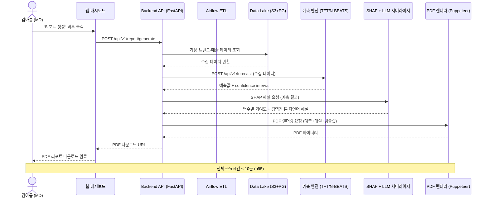

#### 3.4.2 쇼핑몰 API 1-Click 연동 흐름

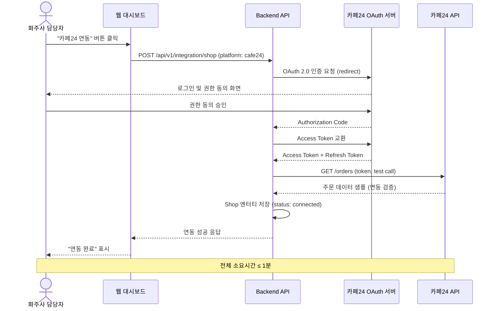

#### 3.4.3 적정 인원 역산 및 알림 흐름

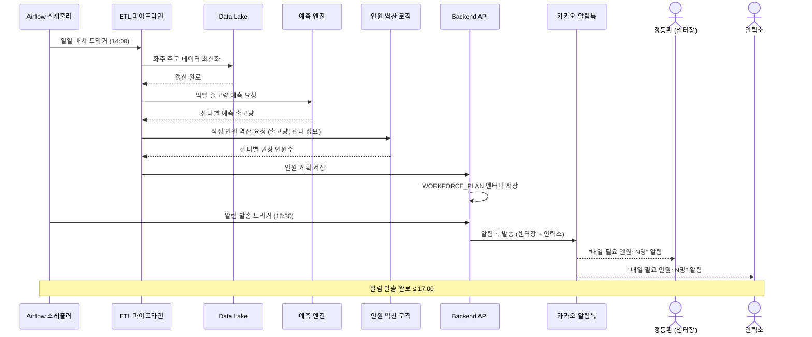

### 3.5 Use Case Overview

아래 다이어그램은 시스템의 주요 액터와 유스케이스 간의 관계를 정의한다.

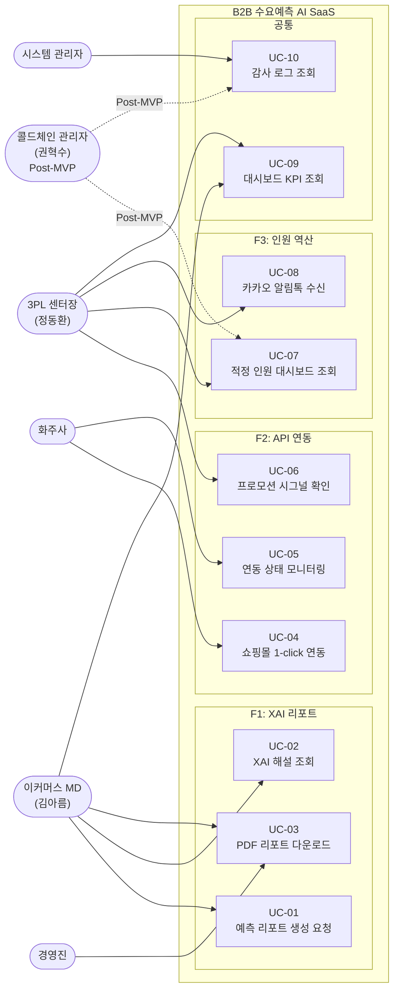

#### Use Case — Requirement 매핑

| UC ID | 유스케이스 명 | 관련 액터 | 관련 기능 | 관련 REQ |
|---|---|---|---|---|
| UC-01 | 예측 리포트 생성 요청 | 이커머스 MD | F1 | REQ-FUNC-004, 005, 006, 007 |
| UC-02 | XAI 해설 조회 | 이커머스 MD | F1 | REQ-FUNC-005, 006, 010 |
| UC-03 | PDF 리포트 다운로드 | 이커머스 MD, 경영진 | F1 | REQ-FUNC-007, 008 |
| UC-04 | 쇼핑몰 1-click 연동 | 화주사 | F2 | REQ-FUNC-011, 012 |
| UC-05 | 연동 상태 모니터링 | 화주사 | F2 | REQ-FUNC-016 |
| UC-06 | 프로모션 시그널 확인 | 3PL 센터장 | F2 | REQ-FUNC-017 |
| UC-07 | 적정 인원 대시보드 조회 | 3PL 센터장, 콜드체인 관리자(Post-MVP) | F3 | REQ-FUNC-018, 020 |
| UC-08 | 카카오 알림톡 수신 | 3PL 센터장 | F3 | REQ-FUNC-021, 022 |
| UC-09 | 대시보드 KPI 조회 | 이커머스 MD, 3PL 센터장 | 공통 | REQ-FUNC-010, 020 |
| UC-10 | 감사 로그 조회 | 시스템 관리자, 콜드체인 관리자(Post-MVP) | 공통 | REQ-FUNC-026 |

### 3.6 Component Architecture

아래 다이어그램은 시스템의 주요 컴포넌트와 레이어 간 의존 관계를 정의한다.

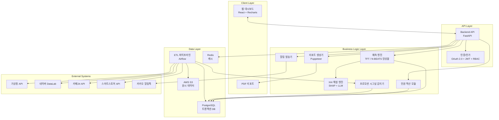

#### Component 설명

| 컴포넌트 | 레이어 | 기술 스택 | 책임 | 관련 REQ |
|---|---|---|---|---|
| 웹 대시보드 | Client | React, Recharts | 예측 결과 시각화, KPI 모니터링, 인원 역산 조회 | REQ-FUNC-010, 020 |
| Backend API | API | Python, FastAPI | 모든 내부/외부 API 라우팅, 인증, 비즈니스 오케스트레이션 | 전체 REQ-FUNC |
| 인증/인가 | API | OAuth 2.0, JWT | 사용자 인증, RBAC 기반 접근 제어 | REQ-FUNC-023 |
| 예측 엔진 | Business Logic | PyTorch (TFT/N-BEATS) | 시계열 수요 예측 추론 | REQ-FUNC-004 |
| XAI 해설 엔진 | Business Logic | SHAP, LLM | 변수별 기여도 산출 및 자연어 해설 | REQ-FUNC-005, 006 |
| 인원 역산 모듈 | Business Logic | Python | 출고량 기반 적정 인원 산출 | REQ-FUNC-018, 019 |
| 리포트 생성기 | Business Logic | Puppeteer | HTML → PDF 변환, 경영진 양식 렌더링 | REQ-FUNC-007, 008 |
| 알림 발송기 | Business Logic | Python | 카카오 알림톡 API 연동 발송 | REQ-FUNC-021, 022 |
| 프로모션 감지기 | Business Logic | Python | 주문 급증 패턴 분석, 프로모션 플래그 설정 | REQ-FUNC-017 |
| ETL 파이프라인 | Data | Apache Airflow | 외부 API 수집 → 변환 → 적재 자동화 | REQ-FUNC-001, 002, 013, 025 |
| PostgreSQL | Data | PostgreSQL | 트랜잭션 데이터 영속 저장 | 전체 엔터티 |
| AWS S3 | Data | AWS S3 | 원시 JSON 데이터 아카이브 | — |
| Redis | Data | Redis | API 응답 캐시, 기상 폴백 캐시 | REQ-FUNC-003, 015 |

---

## 4. Specific Requirements

### 4.1 Functional Requirements

#### 4.1.1 F1 — XAI 원클릭 리포트 추출 (Must)

| ID | 요구사항 | Source | Priority | Acceptance Criteria |
|---|---|---|---|---|
| **REQ-FUNC-001** | 시스템은 기상청 단기예보 API로부터 지역별 기온·강수·풍속 데이터를 일 1회 이상 자동 수집하여 Data Lake에 저장해야 한다. | Story 1, F1 | Must | **Given** 기상청 API 연결이 정상 상태일 때 **When** Airflow DAG이 스케줄에 따라 실행되면 **Then** 해당 지역의 기온·강수·풍속 데이터가 WEATHER_DATA 엔터티에 저장된다. 수집 실패 시 자동 재시도 3회 수행 후 Slack 알림 발송. |
| **REQ-FUNC-002** | 시스템은 네이버 DataLab API로부터 지정된 키워드의 검색량 지수를 일 1회 이상 자동 수집하여 Data Lake에 저장해야 한다. | Story 1, F1 | Must | **Given** 네이버 DataLab API 연결이 정상 상태일 때 **When** Airflow DAG이 스케줄에 따라 실행되면 **Then** 지정 키워드의 검색량 지수가 TREND_DATA 엔터티에 저장된다. |
| **REQ-FUNC-003** | 시스템은 기상청 API 수집 실패 시 최근 24시간 캐시 데이터로 자동 전환(폴백)해야 한다. | Story 1, F1 | Must | **Given** 기상청 API 호출이 3회 연속 실패한 상태일 때 **When** 예측 엔진이 기상 데이터를 요청하면 **Then** 최근 24시간 내 캐시된 데이터가 반환된다. 폴백 전환 사실이 로그에 기록된다. |
| **REQ-FUNC-004** | 시스템은 수집된 기상·트렌드·매출 데이터를 입력으로 시계열 예측 모델(TFT/N-BEATS 앙상블)을 실행하여 SKU별 수요 예측값과 신뢰 구간(confidence interval)을 산출해야 한다. | Story 1, F1 | Must | **Given** 기상·트렌드·매출 데이터가 Data Lake에 수집 완료된 상태일 때 **When** 예측 엔진 API가 호출되면 **Then** SKU별 predicted_qty와 confidence_interval이 FORECAST 엔터티에 저장된다. |
| **REQ-FUNC-005** | 시스템은 예측 결과에 대해 SHAP 기반 변수별 기여도(shap_value)를 산출하고 FORECAST_FACTOR 엔터티에 저장해야 한다. | Story 1, F1 | Must | **Given** 예측 모델이 SKU별 예측값을 산출한 상태일 때 **When** XAI 해설 모듈이 실행되면 **Then** 각 예측 결과에 대한 변수별 SHAP value가 FORECAST_FACTOR.shap_value에 저장된다. |
| **REQ-FUNC-006** | 시스템은 SHAP 기반 변수 기여도를 LLM 서머라이저를 통해 경영진 톤의 한국어 자연어 해설 텍스트로 변환해야 한다. | Story 1 AC-4, F1 | Must | **Given** SHAP value가 산출된 상태일 때 **When** LLM 서머라이저가 실행되면 **Then** FORECAST_FACTOR.explanation_text에 경영진이 이해 가능한 자연어 해설이 저장된다. 해설 충족률 ≥ 95% (경영진 양식 매칭 기준). |
| **REQ-FUNC-007** | 사용자가 '리포트 생성' 버튼을 클릭하면 시스템은 예측 결과 + XAI 해설이 포함된 발주 권장 PDF 리포트를 자동 생성해야 한다. | Story 1 AC-1, F1 | Must | **Given** 기상·트렌드·매출 데이터 수집이 완료된 상태일 때 **When** 사용자가 '리포트 생성' 버튼을 클릭하면 **Then** 예측값·XAI 해설·변수 기여도 차트가 포함된 PDF가 생성된다. 생성 소요시간 ≤ 10분 (p95). |
| **REQ-FUNC-008** | 생성된 PDF 리포트의 레이아웃은 파일럿 고객의 기존 경영진 결재 양식(엑셀 표 + 요약 텍스트)과 호환되는 포맷이어야 한다. | Story 1 AC-5, F1 | Must | **Given** 리포트 PDF가 생성된 상태일 때 **When** 경영진이 리포트를 검토하면 **Then** 기존 결재 양식 대비 호환율 100%를 달성한다. 양식 구성: 엑셀 표 형태 데이터 섹션 + 요약 텍스트 섹션 + XAI 해설 섹션. |
| **REQ-FUNC-009** | 시스템은 생성된 리포트의 상태(draft/approved/rejected)를 REPORT 엔터티에 기록하고 추적해야 한다. | Story 1 AC-2, F1 | Must | **Given** PDF 리포트가 생성된 상태일 때 **When** 리포트 상태 변경 이벤트가 발생하면 **Then** REPORT.status가 해당 상태로 갱신되고 변경 이력이 감사 로그에 기록된다. |
| **REQ-FUNC-010** | 시스템은 웹 대시보드에서 예측 결과 및 변수별 기여도 차트를 시각화해야 한다. | Story 1, F1 | Must | **Given** 예측 결과와 SHAP value가 저장된 상태일 때 **When** 사용자가 대시보드에 접속하면 **Then** SKU별 예측 수요량 차트, 변수별 기여도 차트(SHAP waterfall/bar), 신뢰 구간 밴드가 Recharts 기반으로 렌더링된다. 페이지 로드 ≤ 2초 (p95). |

#### 4.1.2 F2 — 쇼핑몰 API 원클릭 연동 모듈 (Must)

| ID | 요구사항 | Source | Priority | Acceptance Criteria |
|---|---|---|---|---|
| **REQ-FUNC-011** | 시스템은 카페24 플랫폼에 대해 OAuth 2.0 기반 1-click 인증 플로우를 제공하여, 화주사가 별도 개발 없이 연동을 완료할 수 있어야 한다. | Story 2 AC-4, F2 | Must | **Given** 화주사 담당자가 웹 대시보드에 로그인한 상태일 때 **When** '카페24 연동' 버튼을 클릭하면 **Then** OAuth 인증 → 권한 동의 → 토큰 발급 → 연동 검증이 완료된다. 연동 소요시간 ≤ 1분, 연동 성공률 ≥ 95%. |
| **REQ-FUNC-012** | 시스템은 스마트스토어 플랫폼에 대해 OAuth 2.0 기반 1-click 인증 플로우를 제공해야 한다. | Story 2 AC-4, F2 | Must | **Given** 화주사 담당자가 웹 대시보드에 로그인한 상태일 때 **When** '스마트스토어 연동' 버튼을 클릭하면 **Then** OAuth 인증 → 권한 동의 → 토큰 발급 → 연동 검증이 완료된다. 연동 소요시간 ≤ 1분, 연동 성공률 ≥ 95%. |
| **REQ-FUNC-013** | 시스템은 연동된 쇼핑몰 플랫폼으로부터 주문 데이터를 주기적으로(최소 1일 1회) 자동 수집하여 ORDER·ORDER_ITEM 엔터티에 저장해야 한다. | Story 2 AC-1, F2 | Must | **Given** 쇼핑몰 API 연동이 완료(SHOP.status = connected)된 상태일 때 **When** Airflow ETL 스케줄이 트리거되면 **Then** 해당 쇼핑몰의 주문 데이터가 ORDER·ORDER_ITEM 엔터티에 적재된다. 수집 지연 ≤ 5분 (p95). |
| **REQ-FUNC-014** | 시스템은 연동된 쇼핑몰 플랫폼으로부터 재고 데이터를 자동 수집하여 INVENTORY 엔터티에 저장해야 한다. | F2 | Must | **Given** 쇼핑몰 API 연동이 완료된 상태일 때 **When** ETL 파이프라인이 재고 수집을 실행하면 **Then** INVENTORY.current_qty, safety_stock이 최신 값으로 갱신된다. |
| **REQ-FUNC-015** | 시스템은 카페24 API Rate Limit(분당 100회)을 초과하지 않도록 배치 큐잉 및 캐시 레이어를 적용해야 한다. | F2, CON-02 | Must | **Given** 카페24 API 호출이 분당 100회에 근접한 상태일 때 **When** 추가 API 호출이 발생하면 **Then** 요청이 배치 큐에 적재되어 Rate Limit 내에서 순차 처리된다. 캐시 히트 시 API 호출 없이 캐시 데이터를 반환한다. |
| **REQ-FUNC-016** | 시스템은 연동된 쇼핑몰의 연결 상태(connected/disconnected)를 SHOP 엔터티에서 관리하고, 연결 해제 시 재연동 안내를 표시해야 한다. | F2 | Must | **Given** 쇼핑몰 API의 OAuth 토큰이 만료되거나 API 호출이 실패한 상태일 때 **When** 시스템이 연결 상태를 점검하면 **Then** SHOP.status가 disconnected로 갱신되고 사용자에게 재연동 안내가 표시된다. |
| **REQ-FUNC-017** | 시스템은 수집된 주문 데이터에서 프로모션(인플루언서 공구 등) 시그널을 감지하여 ORDER.is_promotion 플래그를 설정해야 한다. | Story 2 AC-3, F2 | Must | **Given** 화주사의 주문 데이터가 갱신된 상태일 때 **When** 주문량 급증 패턴 또는 프로모션 키워드가 감지되면 **Then** 해당 주문 건의 is_promotion 플래그가 true로 설정된다. 프로모션 시그널 반영 지연시간 ≤ 5분. |

#### 4.1.3 F3 — 적정 고용 인원 역산 대시보드 (Must)

| ID | 요구사항 | Source | Priority | Acceptance Criteria |
|---|---|---|---|---|
| **REQ-FUNC-018** | 시스템은 예측 출고량, 센터별 작업자 1인당 처리량(capacity_per_worker)을 기반으로 익일 적정 알바 인원수를 자동 산출해야 한다. | Story 2 AC-1, F3 | Must | **Given** 화주사 API 연동이 완료되고 익일 출고량 예측이 산출된 상태일 때 **When** 인원 역산 알고리즘이 실행되면 **Then** 센터별 recommended_workers가 WORKFORCE_PLAN 엔터티에 저장된다. 인원 오차율 ≤ 5%. |
| **REQ-FUNC-019** | 시스템은 프로모션 시그널 감지 시 익일 출고량 예측을 자동 상향 조정하고 인원 역산 결과를 재산출해야 한다. | Story 2 AC-3, F3 | Must | **Given** 화주사의 프로모션 시그널이 감지된 상태일 때 **When** 기존 예측값 대비 출고량 상향이 필요하면 **Then** 예측 출고량이 조정되고 recommended_workers가 재산출된다. 재산출 지연시간 ≤ 5분. |
| **REQ-FUNC-020** | 시스템은 산출된 적정 인원 정보를 웹 대시보드에서 센터별로 시각화해야 한다. | Story 2 AC-5, F3 | Must | **Given** WORKFORCE_PLAN 엔터티에 인원 계획이 저장된 상태일 때 **When** 센터장이 대시보드에 접속하면 **Then** 센터별 예측 출고량, 권장 인원수, 1인당 처리량이 표 및 차트로 표시된다. 페이지 로드 ≤ 2초 (p95). |
| **REQ-FUNC-021** | 시스템은 매일 오후 5시(17:00) 이전에 카카오 알림톡을 통해 센터장 및 인력소에 적정 인원 정보를 자동 발송해야 한다. | Story 2 AC-2, F3 | Must | **Given** 적정 인원 산출이 완료된 상태일 때 **When** 알림 발송 스케줄이 트리거되면 **Then** 센터장과 인력소에 카카오 알림톡이 발송된다. 발송 완료 시각 ≤ 17:00. 알림톡 발송 소요시간 ≤ 10초 (p95). |
| **REQ-FUNC-022** | 시스템은 카카오 알림톡 발송 내역(발송 시각, 수신자, 결과)을 WORKFORCE_PLAN.notified_at에 기록해야 한다. | F3 | Must | **Given** 카카오 알림톡이 발송된 상태일 때 **When** 발송 결과가 수신되면 **Then** WORKFORCE_PLAN.notified_at에 발송 시각이 기록되고 발송 성공/실패 로그가 저장된다. |

#### 4.1.4 공통 — 인증, 멀티테넌트, 데이터 파이프라인

| ID | 요구사항 | Source | Priority | Acceptance Criteria |
|---|---|---|---|---|
| **REQ-FUNC-023** | 시스템은 사용자 인증에 OAuth 2.0 + JWT를 사용하고, 역할 기반 접근 제어(RBAC)를 적용해야 한다. | PRD §5-3 | Must | **Given** 사용자가 로그인을 시도할 때 **When** 유효한 자격 증명을 제출하면 **Then** JWT 토큰이 발급되고 사용자의 역할(MD/센터장/관리자)에 따른 기능 접근이 제어된다. |
| **REQ-FUNC-024** | 시스템은 멀티테넌트 환경에서 테넌트별 데이터를 논리적으로 격리(테넌트별 DB 스키마)해야 한다. | PRD §5-3 | Must | **Given** 복수의 테넌트가 시스템을 사용할 때 **When** 테넌트 A의 사용자가 데이터를 조회하면 **Then** 테넌트 A의 데이터만 반환되고 타 테넌트의 데이터는 접근 불가하다. |
| **REQ-FUNC-025** | 시스템은 Airflow 기반 데이터 파이프라인(ETL)을 통해 외부 API 수집 → 변환 → Data Lake 적재를 자동화해야 한다. | PRD §6-3 | Must | **Given** Airflow DAG이 정의된 상태일 때 **When** 스케줄 시각에 도달하면 **Then** 기상청·트렌드·쇼핑몰 데이터 수집 → 정규화 변환 → PostgreSQL/S3 적재가 자동 수행된다. 실패 시 자동 재시도 3회 + Slack 알림. |
| **REQ-FUNC-026** | 시스템은 모든 사용자 행위 및 시스템 이벤트에 대한 감사 로그(Audit Log)를 기록해야 한다. | PRD §5-3 | Must | **Given** 사용자가 리포트 생성/연동 설정/인원 역산 등 주요 작업을 수행할 때 **When** 해당 이벤트가 발생하면 **Then** 타임스탬프·사용자ID·액션·대상 리소스가 감사 로그에 기록된다. |
| **REQ-FUNC-027** | 시스템은 기상청 단기예보 API Rate Limit(1,000회/일)을 초과하지 않도록 배치 큐잉을 적용해야 한다. | CON-01 | Must | **Given** 기상청 API 일일 호출 횟수가 900회에 도달한 상태일 때 **When** 추가 호출이 발생하면 **Then** 요청이 다음 일자로 이연되거나 캐시 데이터가 사용된다. |

#### 4.1.5 F4 — 콜드체인 실시간 노선 재설정기 (Should, Post-MVP)

| ID | 요구사항 | Source | Priority | Acceptance Criteria |
|---|---|---|---|---|
| **REQ-FUNC-028** | 시스템은 차량 GPS + IoT 온도 센서 데이터를 실시간 수집하고, 유통기한 임계점 T-2시간 도달 시 최적 배송 노선을 강제 재설정하여 기사에게 알려야 한다. | Story 3 AC-1, F4 | Should | **Given** 차량 GPS + IoT 온도 데이터가 실시간 수집 상태일 때 **When** 유통기한 임계점 T-2시간에 도달하면 **Then** AI가 최적 배송 노선을 재설정하고 기사에게 30초 이내 알림을 발송한다. |
| **REQ-FUNC-029** | 시스템은 배송 전 과정의 온도·위치·의사결정 로그를 법적 추적 가능 형태로 보존해야 한다. | Story 3 AC-3, F4 | Should | **Given** 배송이 완료된 상태일 때 **When** 감사·법적 대응이 필요하면 **Then** 전 과정의 로그가 불변(immutable) 형태로 보존되어 법적 증거로 활용 가능하다. 로그 보존율 100%. |
| **REQ-FUNC-030** | 시스템은 노선 재설정 시 XAI 해설 + 법적 면책 서류를 자동 생성해야 한다. | Story 3 AC-4, F4 | Should | **Given** AI가 노선을 재설정한 상태일 때 **When** 관리자가 의사결정 근거를 확인하면 **Then** 약국 선택 근거에 대한 XAI 해설 + 법적 면책 서류가 자동 생성된다. 자동생성율 100%. |

### 4.2 Non-Functional Requirements

#### 4.2.1 성능 (Performance)

| ID | 요구사항 | 임계치 | 측정 방법 | PRD 참조 |
|---|---|---|---|---|
| **REQ-NF-001** | XAI 리포트 생성 end-to-end 소요시간 (p95) | ≤ 10분 | APM 대시보드 (Datadog) | PRD §5-1, Story 1 AC-1 |
| **REQ-NF-002** | API 연동 데이터 수집 지연 (p95) | ≤ 5분 | ETL 파이프라인 모니터링 | PRD §5-1 |
| **REQ-NF-003** | 대시보드 페이지 로드 (p95) | ≤ 2초 | RUM (Real User Monitoring) | PRD §5-1 |
| **REQ-NF-004** | 예측 모델 추론 (p95) | ≤ 30초 | 모델 서빙 레이턴시 로그 | PRD §5-1 |
| **REQ-NF-005** | 카카오 알림톡 발송 (p95) | ≤ 10초 | 알림 발송 로그 | PRD §5-1 |
| **REQ-NF-006** | 프로모션 시그널 감지 후 예측 재반영 지연 | ≤ 5분 | ETL 파이프라인 로그 | Story 2 AC-3 |
| **REQ-NF-007** | 쇼핑몰 API 1-click 연동 소요시간 | ≤ 1분 | 연동 플로우 타임스탬프 | Story 2 AC-4 |

#### 4.2.2 가용성 및 신뢰성 (Availability & Reliability)

| ID | 요구사항 | 임계치 | PRD 참조 |
|---|---|---|---|
| **REQ-NF-008** | 월 가용성 (SLA) | ≥ 99.5% | PRD §5-2 |
| **REQ-NF-009** | 예측 모델 추론 오류율 | ≤ 0.5% | PRD §5-2 |
| **REQ-NF-010** | 기상청 API 수집 실패 시 폴백 | 최근 24시간 캐시 데이터 자동 전환 | PRD §5-2 |
| **REQ-NF-011** | 데이터 파이프라인 ETL 실패 시 | 자동 재시도 3회 + Slack 알림 | PRD §5-2 |
| **REQ-NF-012** | 카페24 API 연동 성공률 | ≥ 95% | Story 2 AC-4, PRD §1-3 |

#### 4.2.3 보안 (Security)

| ID | 요구사항 | 상세 | PRD 참조 |
|---|---|---|---|
| **REQ-NF-013** | 데이터 전송 암호화 | TLS 1.3 적용 (모든 클라이언트-서버 통신) | PRD §5-3 |
| **REQ-NF-014** | 데이터 저장 암호화 | AES-256 적용 (저장 데이터) | PRD §5-3 |
| **REQ-NF-015** | 인증 및 접근 제어 | OAuth 2.0 + JWT, RBAC (역할: MD, 센터장, 관리자) | PRD §5-3 |
| **REQ-NF-016** | 화주사 데이터 격리 | 멀티테넌트 논리 격리 (테넌트별 DB 스키마) | PRD §5-3 |

#### 4.2.4 비용 (Cost)

| ID | 요구사항 | 임계치 | PRD 참조 |
|---|---|---|---|
| **REQ-NF-017** | MVP 기간 인프라 월 비용 | ≤ 500만 원 (AWS 스타트업 크레딧 활용) | PRD §5-3, CON-03 |

#### 4.2.5 모니터링 및 운영 (Monitoring & Operations)

| ID | 요구사항 | 상세 | 알림 기준 | PRD 참조 |
|---|---|---|---|---|
| **REQ-NF-018** | 인프라/APM 모니터링 | AWS CloudWatch + Datadog | CPU > 80%, 메모리 > 85%, 5xx 에러율 > 1% | PRD §5-4 |
| **REQ-NF-019** | 파이프라인 ETL 모니터링 | Airflow DAG 모니터링 | DAG 실패 시 즉시 Slack 알림 | PRD §5-4 |
| **REQ-NF-020** | 모델 성능 드리프트 모니터링 | 커스텀 대시보드 | MAPE > 기준선 + 10%p 시 재학습 트리거 | PRD §5-4 |
| **REQ-NF-021** | 비즈니스 KPI 모니터링 | Recharts 대시보드 | 결재 반려 발생 / 인건비 절감률 < 20% 시 알림 | PRD §5-4 |

#### 4.2.6 확장성 및 유지보수성 (Scalability & Maintainability)

| ID | 요구사항 | 상세 | PRD 참조 |
|---|---|---|---|
| **REQ-NF-022** | 수평 확장 | API 서버는 Stateless로 구현하여 수평 확장(Auto Scaling) 가능해야 한다 | PRD §6-3 아키텍처 |
| **REQ-NF-023** | 모듈 독립성 | 데이터 수집·예측 엔진·리포트 생성·알림 발송은 독립 모듈로 분리하여 개별 배포 가능해야 한다 | PRD §6-3 아키텍처 |
| **REQ-NF-024** | 외부 API 버전 관리 | 카페24·스마트스토어 등 외부 API 스펙 변경에 대비한 어댑터 패턴을 적용해야 한다 | PRD §7-3 R2 |

#### 4.2.7 비즈니스 KPI (정량 목표)

| ID | 요구사항 | 기준선 (As-Is) | 목표값 (To-Be) | 측정 주기 | PRD 참조 |
|---|---|---|---|---|---|
| **REQ-NF-025** | 고객의 재무 손실 방어율 (북극성 KPI) | 0% | ≥ 90% | 월간 | PRD §1-3 |
| **REQ-NF-026** | 파일럿 고객 발주 리포트 1-pass 결재율 | 0% | ≥ 80% | 주간 | PRD §1-3 |
| **REQ-NF-027** | 일용직 인건비 절감률 (3PL 고객) | 0% | ≥ 30% | 월간 | PRD §1-3 |
| **REQ-NF-028** | 카페24 API 연동 성공률 | 0% | ≥ 95% | 주간 | PRD §1-3 |
| **REQ-NF-029** | MVP Phase 파일럿 고객 확보 | 0곳 | 2사 이상 | Sprint 3 종료 시 | PRD §1-3 |
| **REQ-NF-030** | NPS (파일럿 고객) | — | ≥ 40 | 분기 | PRD §1-3 |
| **REQ-NF-031** | 인원 오차율 | 20%+ | ≤ 5% | 일간 | Story 2 AC-1 |
| **REQ-NF-032** | 기회손실 방어율 | 0% | ≥ 90% | 월간 | Story 1 AC-3 |
| **REQ-NF-033** | XAI 해설 충족률 (경영진 양식 매칭) | — | ≥ 95% | 주간 | Story 1 AC-4 |

---

## 5. Traceability Matrix

### 5.1 Story ↔ Requirement ID ↔ Test Case ID

| Story | Story 요약 | Requirement ID | Test Case ID |
|---|---|---|---|
| **Story 1** | 김아름: 결재 방어용 XAI 발주 리포트 | REQ-FUNC-001 | TC-001: 기상 데이터 자동 수집 검증 |
| Story 1 | | REQ-FUNC-002 | TC-002: 트렌드 데이터 자동 수집 검증 |
| Story 1 | | REQ-FUNC-003 | TC-003: 기상 API 폴백 전환 검증 |
| Story 1 | | REQ-FUNC-004 | TC-004: 예측 모델 추론 결과 검증 |
| Story 1 | | REQ-FUNC-005 | TC-005: SHAP 기여도 산출 검증 |
| Story 1 | | REQ-FUNC-006 | TC-006: LLM 자연어 해설 품질 검증 |
| Story 1 | | REQ-FUNC-007 | TC-007: PDF 리포트 생성 시간 검증 (≤10분 p95) |
| Story 1 | | REQ-FUNC-008 | TC-008: PDF 양식 호환성 검증 (100%) |
| Story 1 | | REQ-FUNC-009 | TC-009: 리포트 상태 추적 검증 |
| Story 1 | | REQ-FUNC-010 | TC-010: 대시보드 시각화 렌더링 검증 |
| Story 1 | | REQ-NF-001 | TC-N01: 리포트 생성 p95 성능 검증 |
| Story 1 | | REQ-NF-025 | TC-N25: 재무 손실 방어율 검증 |
| Story 1 | | REQ-NF-026 | TC-N26: 1-pass 결재율 검증 |
| Story 1 | | REQ-NF-032 | TC-N32: 기회손실 방어율 검증 |
| Story 1 | | REQ-NF-033 | TC-N33: XAI 해설 충족률 검증 |
| **Story 2** | 정동환: 적정 알바 인원 사전 확정 | REQ-FUNC-011 | TC-011: 카페24 OAuth 연동 성공률 검증 |
| Story 2 | | REQ-FUNC-012 | TC-012: 스마트스토어 OAuth 연동 검증 |
| Story 2 | | REQ-FUNC-013 | TC-013: 주문 데이터 자동 수집 검증 |
| Story 2 | | REQ-FUNC-014 | TC-014: 재고 데이터 수집 검증 |
| Story 2 | | REQ-FUNC-015 | TC-015: Rate Limit 배치 큐잉 검증 |
| Story 2 | | REQ-FUNC-016 | TC-016: 연동 상태 관리 검증 |
| Story 2 | | REQ-FUNC-017 | TC-017: 프로모션 시그널 감지 검증 |
| Story 2 | | REQ-FUNC-018 | TC-018: 적정 인원 산출 정확도 검증 (오차 ≤5%) |
| Story 2 | | REQ-FUNC-019 | TC-019: 프로모션 반영 재산출 검증 (≤5분) |
| Story 2 | | REQ-FUNC-020 | TC-020: 인원 대시보드 시각화 검증 |
| Story 2 | | REQ-FUNC-021 | TC-021: 알림톡 발송 시각 검증 (≤17:00) |
| Story 2 | | REQ-FUNC-022 | TC-022: 알림 발송 내역 기록 검증 |
| Story 2 | | REQ-NF-005 | TC-N05: 알림톡 발송 p95 성능 검증 |
| Story 2 | | REQ-NF-012 | TC-N12: 카페24 연동 성공률 검증 (≥95%) |
| Story 2 | | REQ-NF-027 | TC-N27: 인건비 절감률 검증 (≥30%) |
| Story 2 | | REQ-NF-028 | TC-N28: 연동 성공률 검증 |
| Story 2 | | REQ-NF-031 | TC-N31: 인원 오차율 검증 (≤5%) |
| **Story 3** *(Post-MVP)* | 권혁수: 폐기 리스크 제로 통제 | REQ-FUNC-028 | TC-028: 노선 재설정 응답 시간 검증 (≤30초) |
| Story 3 | | REQ-FUNC-029 | TC-029: 법적 추적 로그 보존율 검증 (100%) |
| Story 3 | | REQ-FUNC-030 | TC-030: 면책 서류 자동생성율 검증 (100%) |
| **공통** | 인증·보안·파이프라인 | REQ-FUNC-023 | TC-023: RBAC 접근 제어 검증 |
| 공통 | | REQ-FUNC-024 | TC-024: 멀티테넌트 데이터 격리 검증 |
| 공통 | | REQ-FUNC-025 | TC-025: ETL 자동 재시도 검증 |
| 공통 | | REQ-FUNC-026 | TC-026: 감사 로그 기록 검증 |
| 공통 | | REQ-FUNC-027 | TC-027: 기상청 Rate Limit 준수 검증 |
| 공통 | | REQ-NF-008 | TC-N08: SLA 99.5% 가용성 검증 |
| 공통 | | REQ-NF-013 | TC-N13: TLS 1.3 적용 검증 |
| 공통 | | REQ-NF-014 | TC-N14: AES-256 저장 암호화 검증 |
| 공통 | | REQ-NF-015 | TC-N15: OAuth 2.0 + JWT 인증 검증 |
| 공통 | | REQ-NF-016 | TC-N16: 멀티테넌트 격리 검증 |
| 공통 | | REQ-NF-017 | TC-N17: 인프라 월 비용 ≤500만 원 검증 |

---

## 6. Appendix

### 6.1 API Endpoint List

| ID | 메서드 | 엔드포인트 | 설명 | 인증 | Request Body (주요 필드) | Response (주요 필드) | 관련 REQ |
|---|---|---|---|---|---|---|---|
| API-INT-01 | POST | `/api/v1/forecast` | 수요 예측 실행 | JWT (Bearer) | `{ tenant_id, target_date, sku_ids[], parameters }` | `{ forecasts: [{ sku_id, predicted_qty, confidence_interval, model_version }] }` | REQ-FUNC-004, 005 |
| API-INT-02 | POST | `/api/v1/report/generate` | PDF 리포트 생성 | JWT (Bearer) | `{ tenant_id, forecast_id, template_id }` | `{ report_id, status, download_url }` | REQ-FUNC-007, 008 |
| API-INT-03 | GET | `/api/v1/report/{report_id}` | 리포트 상태 조회 | JWT (Bearer) | — | `{ report_id, type, status, generated_at }` | REQ-FUNC-009 |
| API-INT-04 | POST | `/api/v1/integration/shop` | 쇼핑몰 연동 시작 | JWT (Bearer) | `{ platform, redirect_url }` | `{ auth_url }` | REQ-FUNC-011, 012 |
| API-INT-05 | POST | `/api/v1/integration/shop/callback` | OAuth 콜백 처리 | — | `{ code, state }` | `{ shop_id, platform, status }` | REQ-FUNC-011, 012 |
| API-INT-06 | GET | `/api/v1/integration/shop/{shop_id}/status` | 연동 상태 조회 | JWT (Bearer) | — | `{ shop_id, platform, status, last_sync }` | REQ-FUNC-016 |
| API-INT-07 | POST | `/api/v1/workforce/calculate` | 적정 인원 역산 | JWT (Bearer) | `{ tenant_id, center_id, target_date }` | `{ predicted_shipments, recommended_workers, capacity_per_worker }` | REQ-FUNC-018 |
| API-INT-08 | GET | `/api/v1/workforce/plan/{center_id}` | 인원 계획 조회 | JWT (Bearer) | Query: `target_date` | `{ workforce_plans: [...] }` | REQ-FUNC-020 |
| API-INT-09 | POST | `/api/v1/notification/send` | 알림톡 발송 | JWT (Bearer) | `{ recipients[], template_id, variables }` | `{ notification_id, status, sent_at }` | REQ-FUNC-021, 022 |
| API-INT-10 | GET | `/api/v1/dashboard/forecast` | 대시보드 예측 데이터 | JWT (Bearer) | Query: `tenant_id, date_range` | `{ forecasts[], factors[] }` | REQ-FUNC-010 |
| API-INT-11 | POST | `/api/v1/xai/explain` | XAI 해설 생성 | JWT (Bearer) | `{ forecast_id }` | `{ factors: [{ factor_type, shap_value, explanation_text }] }` | REQ-FUNC-005, 006 |
| API-EXT-01 | GET | 기상청 단기예보 엔드포인트 | 기상 데이터 수집 | API Key | `{ regionCode, date }` | `{ temperature, precipitation, windSpeed }` | REQ-FUNC-001 |
| API-EXT-02 | GET | 카페24 주문 엔드포인트 | 주문 데이터 수집 | OAuth 2.0 | `{ start_date, end_date }` | `{ orders: [...] }` | REQ-FUNC-013 |
| API-EXT-03 | GET | 네이버 DataLab 엔드포인트 | 트렌드 데이터 수집 | API Key | `{ keywords[], period }` | `{ results: [{ keyword, search_volume }] }` | REQ-FUNC-002 |
| API-EXT-04 | POST | 카카오 알림톡 엔드포인트 | 알림 발송 | API Key | `{ recipient, template_code, variables }` | `{ result_code, message }` | REQ-FUNC-021 |

### 6.2 Entity & Data Model

#### Entity-Relationship Diagram (ERD)

아래 다이어그램은 시스템의 전체 엔터티 간 관계를 정의한다.

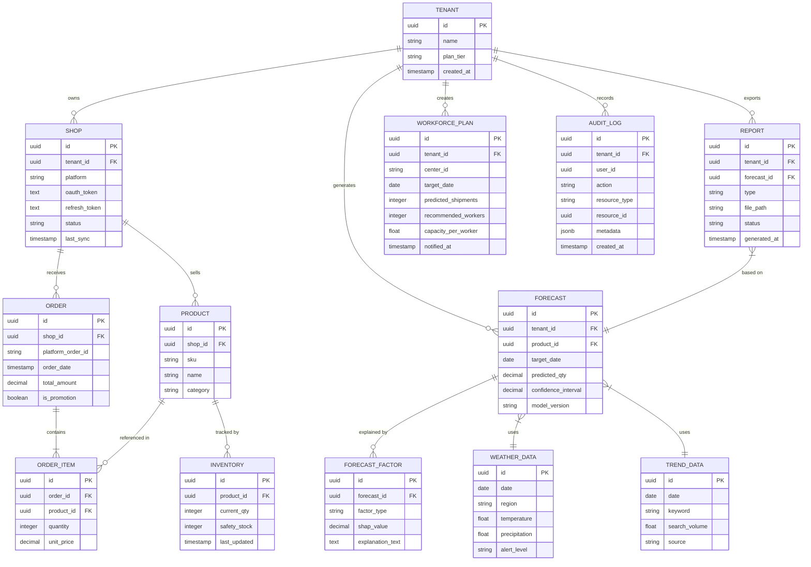

#### 6.2.1 TENANT

| 필드명 | 데이터 타입 | 제약조건 | 설명 |
|---|---|---|---|
| id | UUID | PK, NOT NULL | 테넌트 고유 식별자 |
| name | VARCHAR(255) | NOT NULL | 테넌트(고객사) 명 |
| plan_tier | VARCHAR(50) | NOT NULL, ENUM('basic', 'pro', 'premium', 'headless') | 요금제 구분 |
| created_at | TIMESTAMP | NOT NULL, DEFAULT NOW() | 생성 일시 |

#### 6.2.2 SHOP

| 필드명 | 데이터 타입 | 제약조건 | 설명 |
|---|---|---|---|
| id | UUID | PK, NOT NULL | 쇼핑몰 연동 고유 식별자 |
| tenant_id | UUID | FK → TENANT.id, NOT NULL | 소속 테넌트 |
| platform | VARCHAR(50) | NOT NULL, ENUM('cafe24', 'smartstore', 'coupang') | 연동 플랫폼 |
| oauth_token | TEXT | ENCRYPTED (AES-256) | OAuth Access Token (암호화 저장) |
| refresh_token | TEXT | ENCRYPTED (AES-256) | OAuth Refresh Token (암호화 저장) |
| status | VARCHAR(20) | NOT NULL, ENUM('connected', 'disconnected') | 연동 상태 |
| last_sync | TIMESTAMP | NULLABLE | 최근 동기화 일시 |
| created_at | TIMESTAMP | NOT NULL, DEFAULT NOW() | 생성 일시 |

#### 6.2.3 ORDER

| 필드명 | 데이터 타입 | 제약조건 | 설명 |
|---|---|---|---|
| id | UUID | PK, NOT NULL | 주문 고유 식별자 |
| shop_id | UUID | FK → SHOP.id, NOT NULL | 소속 쇼핑몰 |
| platform_order_id | VARCHAR(100) | NOT NULL, UNIQUE per shop | 플랫폼 원본 주문 ID |
| order_date | TIMESTAMP | NOT NULL | 주문 일시 |
| total_amount | DECIMAL(15,2) | NOT NULL | 총 주문 금액 (원) |
| is_promotion | BOOLEAN | NOT NULL, DEFAULT FALSE | 프로모션 주문 여부 |

#### 6.2.4 PRODUCT

| 필드명 | 데이터 타입 | 제약조건 | 설명 |
|---|---|---|---|
| id | UUID | PK, NOT NULL | 상품 고유 식별자 |
| shop_id | UUID | FK → SHOP.id, NOT NULL | 소속 쇼핑몰 |
| sku | VARCHAR(100) | NOT NULL | 상품 SKU 코드 |
| name | VARCHAR(500) | NOT NULL | 상품명 |
| category | VARCHAR(200) | NULLABLE | 상품 카테고리 |

#### 6.2.5 ORDER_ITEM

| 필드명 | 데이터 타입 | 제약조건 | 설명 |
|---|---|---|---|
| id | UUID | PK, NOT NULL | 주문 항목 고유 식별자 |
| order_id | UUID | FK → ORDER.id, NOT NULL | 소속 주문 |
| product_id | UUID | FK → PRODUCT.id, NOT NULL | 주문 상품 |
| quantity | INTEGER | NOT NULL, > 0 | 주문 수량 |
| unit_price | DECIMAL(15,2) | NOT NULL | 단가 (원) |

#### 6.2.6 INVENTORY

| 필드명 | 데이터 타입 | 제약조건 | 설명 |
|---|---|---|---|
| id | UUID | PK, NOT NULL | 재고 고유 식별자 |
| product_id | UUID | FK → PRODUCT.id, NOT NULL, UNIQUE | 대상 상품 |
| current_qty | INTEGER | NOT NULL, >= 0 | 현재 재고 수량 |
| safety_stock | INTEGER | NOT NULL, >= 0 | 안전 재고 수량 |
| last_updated | TIMESTAMP | NOT NULL | 최종 갱신 일시 |

#### 6.2.7 FORECAST

| 필드명 | 데이터 타입 | 제약조건 | 설명 |
|---|---|---|---|
| id | UUID | PK, NOT NULL | 예측 고유 식별자 |
| tenant_id | UUID | FK → TENANT.id, NOT NULL | 소속 테넌트 |
| product_id | UUID | FK → PRODUCT.id, NULLABLE | 대상 상품 (NULL인 경우 센터 전체 예측) |
| target_date | DATE | NOT NULL | 예측 대상 날짜 |
| predicted_qty | DECIMAL(15,2) | NOT NULL | 예측 수량 |
| confidence_interval | DECIMAL(5,4) | NOT NULL | 신뢰 구간 (예: 0.95) |
| model_version | VARCHAR(50) | NOT NULL | 사용된 모델 버전 |
| created_at | TIMESTAMP | NOT NULL, DEFAULT NOW() | 예측 생성 일시 |

#### 6.2.8 FORECAST_FACTOR

| 필드명 | 데이터 타입 | 제약조건 | 설명 |
|---|---|---|---|
| id | UUID | PK, NOT NULL | 예측 요인 고유 식별자 |
| forecast_id | UUID | FK → FORECAST.id, NOT NULL | 소속 예측 |
| factor_type | VARCHAR(50) | NOT NULL, ENUM('weather', 'trend', 'promotion', 'seasonality') | 요인 유형 |
| shap_value | DECIMAL(10,6) | NOT NULL | SHAP 기여도 값 |
| explanation_text | TEXT | NOT NULL | 경영진 톤 자연어 해설 |

#### 6.2.9 WEATHER_DATA

| 필드명 | 데이터 타입 | 제약조건 | 설명 |
|---|---|---|---|
| id | UUID | PK, NOT NULL | 기상 데이터 고유 식별자 |
| date | DATE | NOT NULL | 기상 예보 날짜 |
| region | VARCHAR(100) | NOT NULL | 지역명/코드 |
| temperature | FLOAT | NOT NULL | 기온 (°C) |
| precipitation | FLOAT | NOT NULL | 강수량 (mm) |
| wind_speed | FLOAT | NULLABLE | 풍속 (m/s) |
| alert_level | VARCHAR(20) | NULLABLE, ENUM('normal', 'caution', 'warning', 'severe') | 기상 특보 수준 |
| collected_at | TIMESTAMP | NOT NULL, DEFAULT NOW() | 수집 일시 |

#### 6.2.10 TREND_DATA

| 필드명 | 데이터 타입 | 제약조건 | 설명 |
|---|---|---|---|
| id | UUID | PK, NOT NULL | 트렌드 데이터 고유 식별자 |
| date | DATE | NOT NULL | 검색 트렌드 날짜 |
| keyword | VARCHAR(200) | NOT NULL | 검색 키워드 |
| search_volume | FLOAT | NOT NULL | 검색량 지수 |
| source | VARCHAR(50) | NOT NULL, ENUM('naver', 'google') | 데이터 출처 |
| collected_at | TIMESTAMP | NOT NULL, DEFAULT NOW() | 수집 일시 |

#### 6.2.11 REPORT

| 필드명 | 데이터 타입 | 제약조건 | 설명 |
|---|---|---|---|
| id | UUID | PK, NOT NULL | 리포트 고유 식별자 |
| tenant_id | UUID | FK → TENANT.id, NOT NULL | 소속 테넌트 |
| forecast_id | UUID | FK → FORECAST.id, NOT NULL | 기반 예측 |
| type | VARCHAR(20) | NOT NULL, ENUM('pdf', 'dashboard') | 리포트 유형 |
| template_id | VARCHAR(50) | NULLABLE | 사용된 PDF 템플릿 |
| file_path | TEXT | NULLABLE | PDF 파일 저장 경로 (S3 URL) |
| generated_at | TIMESTAMP | NOT NULL, DEFAULT NOW() | 생성 일시 |
| status | VARCHAR(20) | NOT NULL, ENUM('draft', 'approved', 'rejected') | 결재 상태 |

#### 6.2.12 WORKFORCE_PLAN

| 필드명 | 데이터 타입 | 제약조건 | 설명 |
|---|---|---|---|
| id | UUID | PK, NOT NULL | 인원 계획 고유 식별자 |
| tenant_id | UUID | FK → TENANT.id, NOT NULL | 소속 테넌트 |
| center_id | VARCHAR(100) | NOT NULL | 물류 센터 식별자 |
| target_date | DATE | NOT NULL | 예측 대상 날짜 |
| predicted_shipments | INTEGER | NOT NULL | 예측 출고 건수 |
| recommended_workers | INTEGER | NOT NULL | 권장 인원수 |
| capacity_per_worker | FLOAT | NOT NULL | 1인당 처리량 (건/명) |
| notified_at | TIMESTAMP | NULLABLE | 알림 발송 일시 |
| created_at | TIMESTAMP | NOT NULL, DEFAULT NOW() | 생성 일시 |

#### 6.2.13 AUDIT_LOG

| 필드명 | 데이터 타입 | 제약조건 | 설명 |
|---|---|---|---|
| id | UUID | PK, NOT NULL | 로그 고유 식별자 |
| tenant_id | UUID | FK → TENANT.id, NOT NULL | 소속 테넌트 |
| user_id | UUID | NOT NULL | 행위 수행 사용자 |
| action | VARCHAR(100) | NOT NULL | 수행 행위 (예: REPORT_GENERATED, SHOP_CONNECTED) |
| resource_type | VARCHAR(50) | NOT NULL | 대상 리소스 유형 |
| resource_id | UUID | NOT NULL | 대상 리소스 ID |
| metadata | JSONB | NULLABLE | 추가 메타데이터 |
| created_at | TIMESTAMP | NOT NULL, DEFAULT NOW() | 로그 기록 일시 |

### 6.3 Detailed Interaction Models

#### 6.3.1 데이터 수집 파이프라인 상세 시퀀스

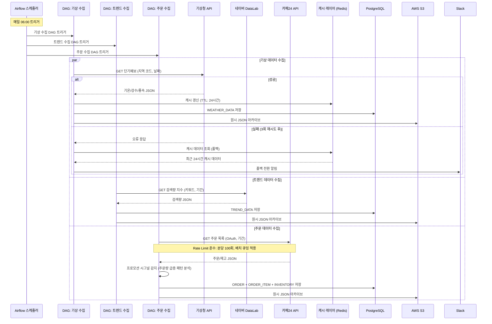

#### 6.3.2 예측 엔진 + XAI 해설 생성 상세 시퀀스

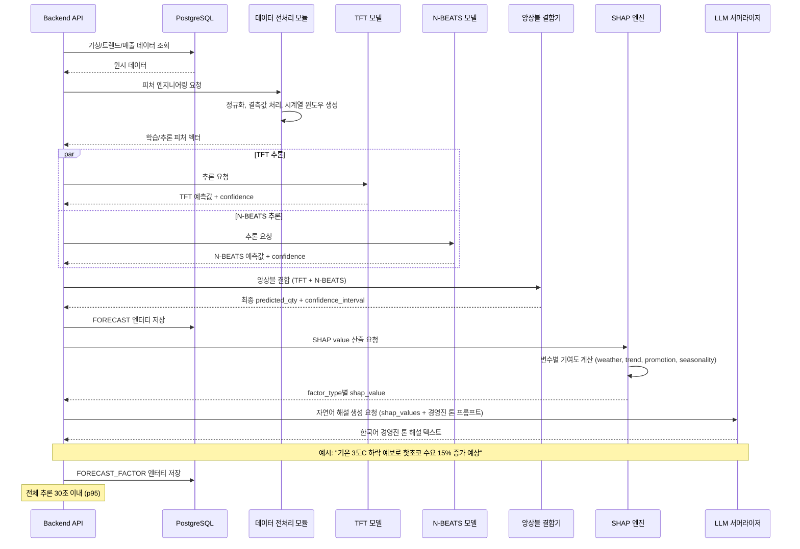

#### 6.3.3 PDF 리포트 생성 상세 시퀀스

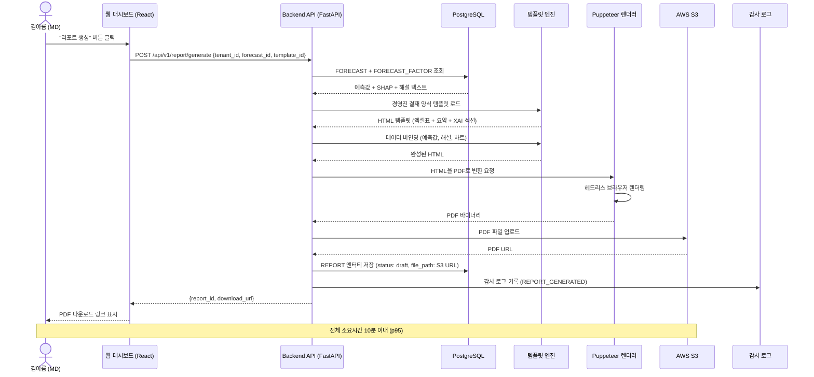

#### 6.3.4 인원 역산 + 알림 발송 상세 시퀀스

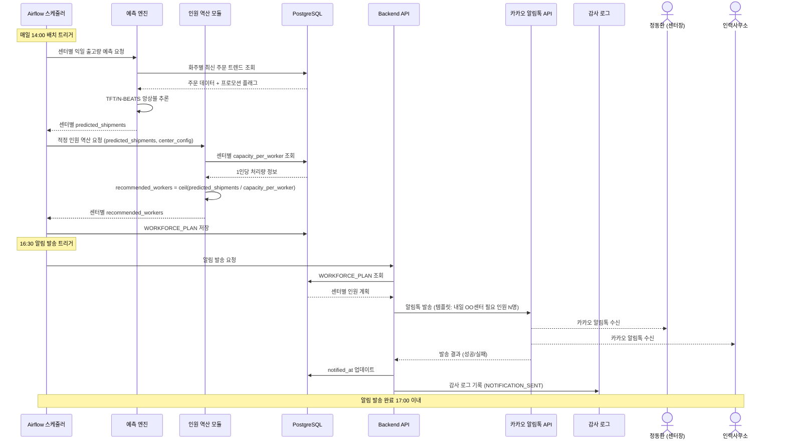

### 6.4 Validation Plan

| 실험 ID | 설계 | 대상 | 측정 지표 | 성공 기준 | 일정 | PRD 참조 |
|---|---|---|---|---|---|---|
| **EXP-01** | 파일럿 PoC (pre-post 비교) | 고객 2사 MD (김아름 유형) | 1-pass 결재율, 기회손실 방어율 | 결재율 ≥ 80%, 방어율 ≥ 90% | Phase 3 (4주) | PRD §8-2 |
| **EXP-02** | 파일럿 PoC (pre-post 비교) | 고객 물류센터 (정동환 유형) | 인건비 절감률, 인원 오차율 | 절감률 ≥ 30%, 오차 ≤ 5% | Phase 3 (4주) | PRD §8-2 |
| **EXP-03** | A/B 테스트 | 파일럿 사용자 n≥30 | XAI 해설 만족도 (5점 척도), 리포트 신뢰도 | XAI 그룹 ≥ 4.0 (대조군 대비 +1.0 이상) | Post-MVP | PRD §8-2 |
| **EXP-04** | 벤치마크 | 내부 | 예측 MAPE vs 고객 기존 엑셀 MAPE | 우리 MAPE < 기존 MAPE × 0.7 | Phase 2~3 | PRD §8-2 |

### 6.5 Class Diagram (Domain Model)

아래 다이어그램은 시스템의 핵심 도메인 객체, 속성, 주요 오퍼레이션 및 객체 간 관계를 정의한다.

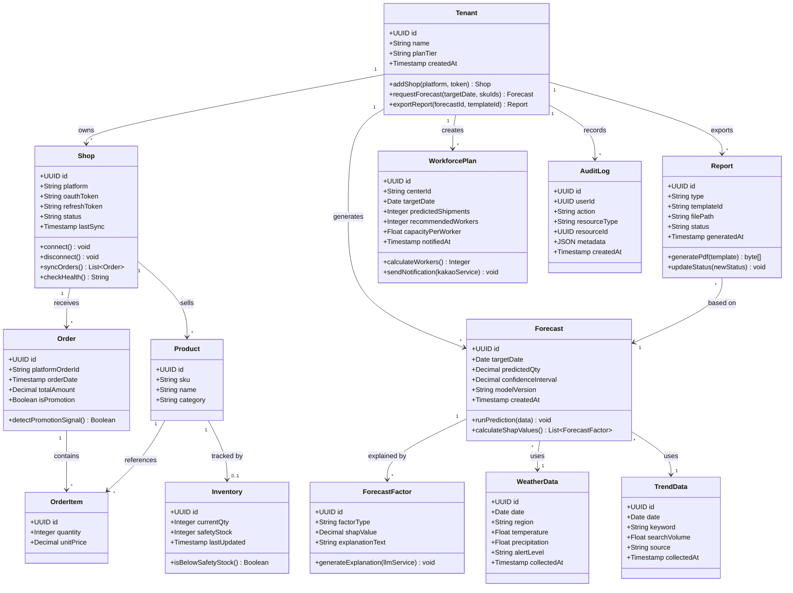

---

*End of SRS-001 v1.0 — Rev 1.1 (다이어그램 보완)*
